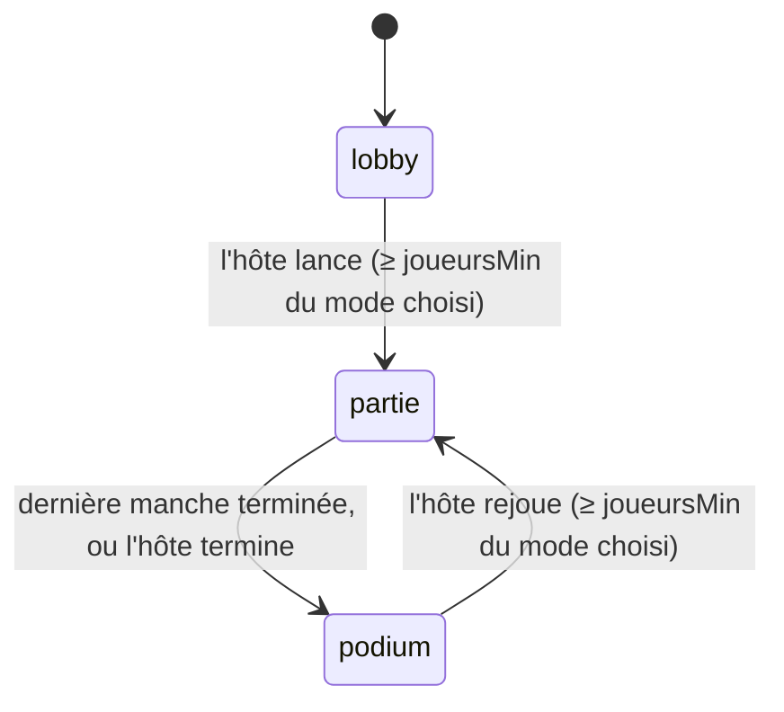

# Tranche 11 — Choix du mode + Estimation

Mini-spec de la tranche 11. Elle complète `docs/spec.md` et reprend les conclusions de la revue d'architecture faite avant l'étape « Modes de jeu ». Elle a été validée le 24/09/2026.

La tranche se code en trois temps, chacun testé avant de passer au suivant :

1. **Socle multi-modes** : le quiz passe par un registre de modes, sans changement visible. Tous les tests existants restent verts.
2. **Choix du mode** : l'hôte choisit le mode sur son téléphone, la TV l'affiche. Seul le quiz est jouable.
3. **Estimation** : le nouveau mode, ses données et ses tests.

## 1. Socle multi-modes

### Registre des modes

Un fichier `server/modes/index.js` exporte le registre :

```js
export const modes = { quiz, estimation };
```

`salles.js` et `index.js` n'importent plus `modes/quiz.js` : ils appellent `modes[salle.mode].…`. Chaque mode exporte le même contrat :

| Membre | Rôle |
|---|---|
| `id`, `nom`, `regleCourte` | Identifiant (`quiz`, `estimation`), nom affiché, règle en une phrase pour la TV |
| `joueursMin` | Nombre minimum de joueurs connectés pour lancer (quiz 2, estimation 3) |
| `demarrerPartie(salle)` | Remet les scores à zéro, tire le contenu, démarre la première manche |
| `enregistrerReponse(salle, joueurId, contenu)` | Valide et enregistre le contenu de `joueur:repondre`. Renvoie `true` si accepté |
| `verifierFinAnticipee(salle)` | Appelée après chaque réponse et chaque déconnexion : passe à la révélation si tous les joueurs attendus ont répondu |
| `suivant(salle)` | Action de `hote:suivant`. Renvoie `true` si quelque chose a changé |
| `echeance(salle)`, `avancer(salle)` | Chrono de la phase en cours, comme aujourd'hui |
| `vueTv(salle)`, `vueJoueur(salle, joueur)` | Contenu de `etatMode` pour la TV, écran et données pour un téléphone |

Pas d'autre membre « pour plus tard » : on ajoutera ce dont les modes suivants ont besoin à leur tranche.

### États de la salle

`salle.etat` ne connaît plus que trois valeurs communes à tous les modes : `lobby`, `partie`, `podium`. La phase propre au mode passe dans `etatMode.phase`.



Pour le quiz comme pour l'estimation, `etatMode.phase` vaut `question` ou `revelation`.

### Code commun

Un fichier `server/modes/commun.js` reçoit ce qui sert à plusieurs modes, extrait de `quiz.js` sans changer son comportement :

- `melanger(liste)` ;
- `tirerQuestions(banque, questionsVues, nombre)` et la mise à jour de `questionsVues` ;
- `classement(salle)` et `rangDe(...)` (ex æquo : 1, 1, 3) ;
- les joueurs attendus d'une manche (`attendus`) et `tousOntRepondu`.

`terminerPartie` devient commun (dans `salles.js`) : si `salle.etat === 'partie'`, on passe au podium. Dans les deux modes de cette tranche, les points ne sont ajoutés qu'à la révélation : une manche en cours n'est donc jamais comptée, sans rien de plus à coder.

`questionsVues` reste une seule liste pour la salle. Les `id` sont uniques entre les banques grâce à leur préfixe : `q…` pour le quiz, `e…` pour l'estimation.

### Clients

- Un script par mode, chargé par une simple balise `<script>` (pas de module, pas de build) : `public/tv/modes/quiz.js`, `public/tv/modes/estimation.js`, `public/joueur/modes/quiz.js`, `public/joueur/modes/estimation.js`. Chacun enregistre ses fonctions d'affichage dans un objet global (`modesTv.estimation = { … }`).
- Les écrans communs restent dans `tv.js` et `joueur.js` : salle d'attente, podium, « En attente de la prochaine question », fin.
- La TV repère un changement d'étape avec `etat`, `etatMode.phase` et `etatMode.numero`, et plus seulement avec le numéro.
- Le serveur envoie `peutTerminer` dans `joueur:etat` (hôte et `etat === 'partie'`). La liste `ECRANS_DE_MANCHE` en dur disparaît de `joueur.js`.

## 2. Choix du mode

### Règles

- Une nouvelle salle démarre en mode `quiz`.
- L'hôte choisit le mode sur son téléphone, en salle d'attente et au podium. Les autres joueurs voient le mode choisi, sans pouvoir le changer.
- Un mode est grisé tant qu'il n'y a pas assez de joueurs connectés pour lui. On ne peut pas le choisir.
- Si le mode choisi devient insuffisant (un joueur part), il reste choisi et le bouton « Lancer la partie » (ou « Rejouer ») est désactivé.
- Au podium, « Rejouer » lance directement le mode choisi, sans repasser par la salle d'attente.
- Avec `MODE_DEV=1`, un seul joueur suffit pour tous les modes. `MODE_DEV` n'est pas activé sur Render.

### Événement

| Événement | Sens | Contenu |
|---|---|---|
| `hote:choisirMode` | téléphone de l'hôte → serveur | `id` du mode (`"quiz"`, `"estimation"`) |

Le serveur ignore l'action si l'émetteur n'est pas l'hôte, si la salle n'est ni en `lobby` ni en `podium`, si le mode n'existe pas ou s'il est grisé. Sinon, il change `salle.mode` et diffuse l'état. `etatMode` n'est pas touché : il est réinitialisé au lancement suivant.

`hote:lancer` et `hote:rejouer` vérifient le nombre de joueurs avec le `joueursMin` du mode choisi (au lieu de 2).

### Ce que reçoivent les clients

- `salle:etat` (TV) : `mode`, et en salle d'attente et au podium `modeChoisi: { id, nom, regleCourte, joueursMin }`.
- `joueur:etat` en salle d'attente et au podium, pour tous : `modeChoisi` (nom) et `assezDeJoueurs` (calculé pour le mode choisi). Pour l'hôte en plus : `modes: [{ id, nom, joueursMin, disponible }]`.

### Écrans

| Où | Contenu |
|---|---|
| TV, salle d'attente | Sous la liste des joueurs : nom du mode choisi, sa règle courte, « 3 joueurs minimum » si le compte n'y est pas |
| TV, podium | « Prochain mode : Estimation » au-dessus de « L'hôte peut relancer » |
| Téléphone de l'hôte, attente et fin | Une rangée de gros boutons, un par mode, celui choisi mis en avant. Un mode grisé affiche « 3 joueurs min. ». Puis « Lancer la partie » ou « Rejouer » |
| Téléphone d'un autre joueur, attente et fin | « Mode : Estimation » |

## 3. Mode Estimation

### Règles

- Une partie compte **8 questions**. Chaque question attend un nombre entier positif ou nul, avec une unité (« Combien de km entre Casablanca et Paris, à vol d'oiseau ? », unité « km »).
- Chaque joueur a **30 s** pour saisir son nombre, en une seule réponse définitive. La rapidité ne rapporte rien.
- Réponses : **entiers seulement**, de 0 à 999 999 999 999. Les questions de la banque sont choisies pour que ce soit naturel (pas de températures négatives, pas de décimales).
- À la révélation, les joueurs qui ont répondu sont classés par **écart** avec la bonne réponse (valeur absolue de la différence). Les **3 plus proches** marquent des points :

  | Rang d'écart | Points |
  |---|---|
  | 1 | 1000 |
  | 2 | 600 |
  | 3 | 300 |
  | 4 et plus, ou pas de réponse | 0 |

- Ex æquo : deux joueurs au même écart ont le même rang et les mêmes points, et le rang suivant est sauté, comme au classement (1, 1, 3). Exemple : écarts 10, 10, 25, 40 → 1000, 1000, 300, 0.
- Avec moins de 3 réponses, seuls les rangs existants rapportent : une seule réponse donne 1000 points.
- Fin anticipée : identique au quiz (joueurs attendus = connectés au début de la manche et encore connectés).
- Classement général par score total, avec les ex æquo du quiz.

### Phases et chronos

| Phase | Durée | Fin |
|---|---|---|
| `question` | 30 s | Tous les attendus ont répondu, ou fin du chrono |
| `revelation` | 10 s | Fin du chrono ou « Suivant » de l'hôte. Après la 8e : podium |

La révélation dure 10 s (au lieu de 8 s au quiz), car la TV montre les nombres de tous les joueurs.

### `etatMode` sur le serveur

```json
{
  "phase": "question",
  "questions": ["...8 questions tirées..."],
  "indexQuestion": 2,
  "debutPhaseA": 1758641190000,
  "attendus": ["j_8f3k2a", "j_1b9c7d"],
  "reponses": { "j_8f3k2a": { "nombre": 1900, "recuA": 1758641195300 } }
}
```

### Événements

Aucun nouvel événement pour le mode : on réutilise ceux du quiz.

| Événement | Contenu en Estimation |
|---|---|
| `joueur:repondre` | Le nombre saisi (entier JavaScript). Refusé s'il n'est pas un entier entre 0 et 999 999 999 999, si ce n'est pas la phase `question`, si le joueur n'est pas attendu ou a déjà répondu. |
| `hote:suivant` | Pendant la révélation : passe à la question suivante (ou au podium) |
| `hote:terminer`, `hote:rejouer` | Comme au quiz |

Le téléphone retire les espaces de la saisie avant l'envoi. Le serveur ne fait jamais confiance à ce contrôle et valide à nouveau.

### Ce que reçoit la TV (`etatMode` de `salle:etat`)

| Phase | Contenu |
|---|---|
| `question` | `phase`, `numero`, `total`, `question: { texte, unite }`, `ontRepondu` (liste d'`id`), `tempsRestantMs` |
| `revelation` | Idem, plus `bonneReponse` (le nombre), `estimations: [{ id, nombre, ecart, rangEcart, points }]` triées par écart, puis `classement` |
| podium | `classement` |

**Jamais avant la révélation** : la bonne réponse et les nombres saisis. Sinon un joueur pourrait les lire sur la TV (ou dans les outils du navigateur de la TV) et se caler sur les autres.

### Ce que reçoit un téléphone (`joueur:etat`)

| Écran | Données |
|---|---|
| `repondre` | `question: { unite }` (le texte est sur la TV) |
| `reponse_envoyee` | Son propre nombre |
| `resultat` | Son nombre (ou rien), son écart, son rang d'écart, ses points, son rang général. Pour l'hôte : « Suivant » |
| `attente_question`, `fin` | Comme au quiz |

**Jamais** : la bonne réponse avant la révélation, ni les nombres des autres joueurs à aucun moment (ils sont sur la TV).

### Écrans

| Où | Écran | Contenu |
|---|---|---|
| TV | Question | « Question 3/8 », texte, unité en gros, chrono, pastilles des joueurs ayant répondu, petit QR code |
| TV | Révélation | Bonne réponse en très gros avec son unité. Dessous, la liste des joueurs triés par écart : pastille, pseudo, nombre, écart (« +120 » ou « −40 »), points gagnés. Les 3 premiers mis en avant. Les absents en bas, « pas de réponse ». Classement général à droite |
| Téléphone | Répondre | Champ numérique géant (`inputmode="numeric"`), unité à droite, aperçu formaté sous le champ (« 1 900 000 km »), gros bouton « Valider » inactif tant que le champ est vide |
| Téléphone | Réponse envoyée | « Réponse envoyée : 1 900 km, regarde la TV » |
| Téléphone | Résultat | « 2e plus proche, +600 » ou « Trop loin » ou « Pas de réponse », écart, rang général |

Les nombres sont toujours affichés avec les espaces français (`Intl.NumberFormat('fr-FR')`), sur la TV comme sur le téléphone.

Contraintes du Mi TV Stick : apparition de la liste de révélation par opacité et déplacement seulement, pas de flou.

### Contenu

**Fichier `data/estimation.json`** : **80 questions**, soit 10 parties sans répétition. Générées par Claude, relues par Paul.

```json
{
  "id": "e0001",
  "texte": "Combien de kilomètres séparent Casablanca de Paris, à vol d'oiseau ?",
  "reponse": 1900,
  "unite": "km",
  "categorie": "geographie",
  "difficulte": 2
}
```

Règles de rédaction :

- La réponse doit être un fait stable et vérifiable. Si elle est très grande, la question fixe l'unité pour garder une saisie courte (« en millions d'habitants »).
- La question précise ce qui est mesuré (« à vol d'oiseau », « en 2020 », « hauteur avec l'antenne »).
- `unite` peut être vide pour un simple nombre (« Combien de touches sur un piano ? »).
- Variété d'ordres de grandeur : des dizaines aux milliards.

**Script `scripts/verifier-estimation.js`**, sur le modèle de `verifier-questions.js` :

- `id` au format `e` + 4 chiffres, unique ;
- `texte` non vide, finit par « ? » ;
- `reponse` entier entre 0 et 999 999 999 999 ;
- `unite` chaîne (vide autorisée), 12 caractères au plus ;
- `categorie` dans la même liste que le quiz, `difficulte` de 1 à 3 ;
- nombre total de questions affiché.

### Cas limites

| Situation | Comportement |
|---|---|
| Joueur déconnecté pendant une question | Ne bloque pas la manche : on vérifie à nouveau la fin anticipée. Pas de réponse, 0 point. |
| Joueur qui revient pendant la même question | S'il avait répondu : « Réponse envoyée » avec son nombre. Sinon, s'il était attendu : il peut encore répondre. S'il n'était pas attendu : attente de la question suivante. |
| Arrivée en cours de partie | 0 point, joue à partir de la question suivante (comme au quiz). |
| Moins de 3 joueurs connectés en cours de partie | La partie continue. Seul « Rejouer » est désactivé tant que le compte n'y est pas (ou l'hôte choisit le quiz). |
| Aucune réponse à une question | Révélation normale : bonne réponse affichée, « pas de réponse » pour tous, personne ne marque. |
| Saisie invalide (vide, lettres, décimale, négatif, trop grand) | Bloquée sur le téléphone (bouton inactif ou message sous le champ). Si elle arrive quand même, le serveur l'ignore et le joueur reste sur « Répondre ». |
| L'hôte termine pendant une question ou une révélation | Podium avec les scores actuels. La question en cours n'est pas comptée. |
| Plus assez de questions inédites | On réautorise les plus anciennes, comme au quiz. |

## Modifications à reporter dans `docs/spec.md`

À faire dans cette tranche, une fois les choix validés :

- « Déroulé d'une partie » : diagramme d'états `lobby | partie | podium`, phases dans `etatMode.phase`.
- « Format des données » : `etat` et `etatMode.phase` dans l'exemple de salle.
- « Événements Socket.IO » : `hote:choisirMode`, contenu de `joueur:repondre` interprété par le mode, `peutTerminer` dans `joueur:etat`.
- « Configuration » : `MODE_DEV=1` autorise 1 joueur pour tous les modes.
- `CLAUDE.md` : structure (`server/modes/index.js`, `commun.js`, `estimation.js`, `public/*/modes/`, `data/estimation.json`, `scripts/verifier-estimation.js`).

## Tests automatiques

Avec `node:test` et, pour les chronos, `mock.timers`.

**Socle** (les tests actuels du quiz sont adaptés à `etat: 'partie'` + `phase`, et doivent rester verts) :

- le registre contient `quiz` et `estimation`, chacun avec tout le contrat ;
- `tirerQuestions` et `classement` déplacés dans `commun.js` gardent leurs tests.

**Choix du mode** :

- un joueur qui n'est pas l'hôte ne peut pas changer de mode ;
- refusé pendant une partie, pour un mode inconnu, pour un mode grisé ;
- accepté en salle d'attente et au podium ;
- `hote:lancer` refusé avec 2 joueurs en Estimation, accepté en quiz ;
- le mode reste choisi quand un joueur part, et `assezDeJoueurs` passe à `false` ;
- `hote:rejouer` au podium lance le mode choisi.

**Estimation** :

- points : écarts distincts (1000/600/300/0), ex æquo (10, 10, 25, 40 → 1000, 1000, 300, 0), une seule réponse (1000), aucune réponse, réponse exacte (écart 0) ;
- validation de `joueur:repondre` : décimal, négatif, texte, trop grand, deuxième réponse, joueur non attendu, hors phase `question` ;
- fin anticipée quand tous ont répondu, et après la déconnexion du dernier attendu ;
- chronos : révélation à 30 s, question suivante 10 s après, podium après la 8e ;
- secret : `vueTv` en phase `question` ne contient ni `bonneReponse` ni les nombres ; `vueJoueur` ne contient jamais `bonneReponse` avant la révélation, ni le nombre d'un autre joueur ;
- `questionsVues` : 3 parties d'estimation puis un quiz ne répètent rien, et les `id` des deux banques cohabitent ;
- `verifier-estimation.js` : détecte un id en double, une réponse décimale, une réponse négative.

## Test de la tranche (à faire toi-même)

Sur Render, TV dans un onglet du PC en 1920×1080, joueurs sur de vrais téléphones et des onglets `?dev`.

1. **Choix du mode.** Ouvrir la TV, rejoindre à 2. L'hôte voit Quiz et Estimation, Estimation grisé (« 3 joueurs min. »). Un 3e joueur arrive : Estimation devient actif. L'hôte le choisit : la TV affiche « Estimation » et sa règle, les autres téléphones « Mode : Estimation ».
2. **Partie.** Lancer. Sur une question, deux joueurs saisissent le même nombre : ils ont les mêmes points à la révélation. La TV ne montre aucun nombre avant la révélation. Un joueur ne répond pas : « Pas de réponse », 0 point.
3. **Saisie.** Taper « 12,5 » ou laisser vide : impossible de valider. Un grand nombre s'affiche avec ses espaces (« 1 900 000 »).
4. **Déconnexion.** Couper un joueur pendant une question (bouton `?dev` « Couper 15 s ») : la manche se termine dès que les autres ont répondu.
5. **Arrêt et podium.** L'hôte termine à la 4e question : podium. Avec 2 joueurs connectés, « Rejouer » est désactivé en Estimation. L'hôte choisit Quiz : « Rejouer » s'active et lance un quiz qui marche comme avant.
