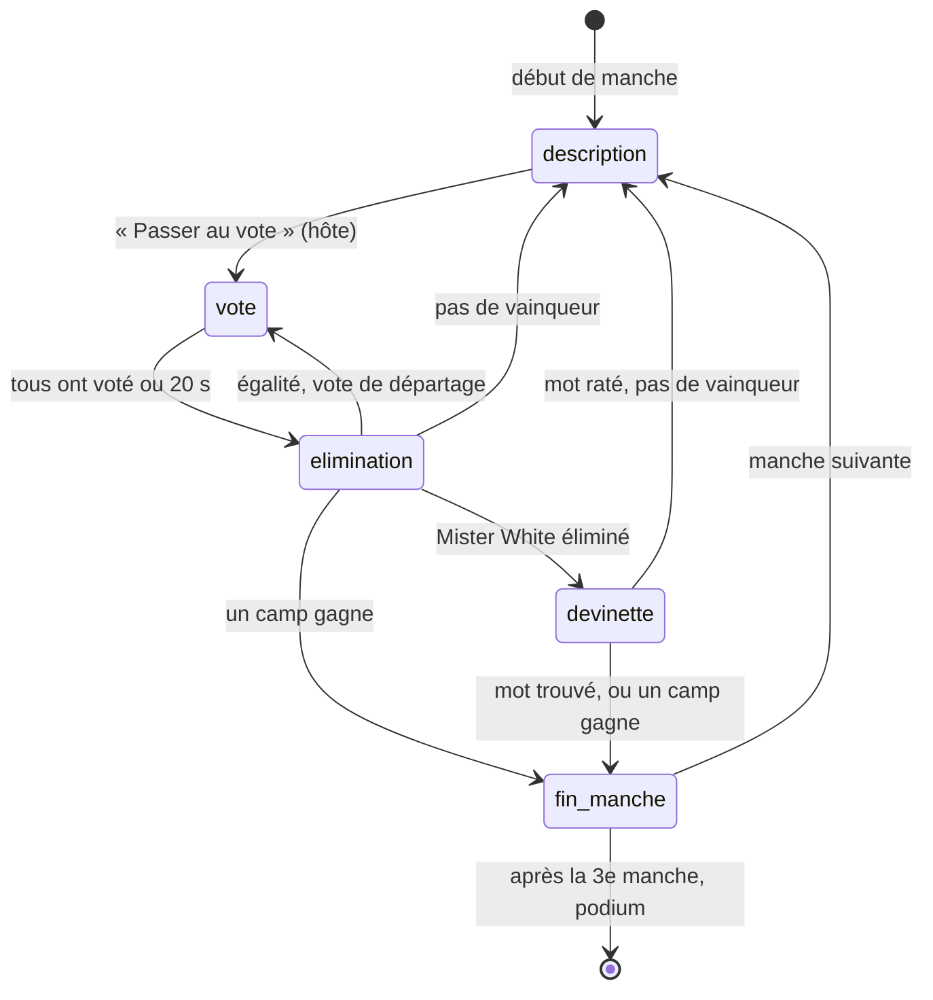

# Tranche 13 — Undercover

Mini-spec de la tranche 13. Elle complète `docs/spec.md` et s'appuie sur le socle multi-modes de la tranche 11 (`docs/modes/estimation.md`) et sur `docs/modes/qui-de-nous.md`. Elle a été validée le 24/09/2026.

Ce mode diffère des précédents sur deux points :

- **un secret par joueur** : chaque téléphone reçoit son propre mot (ou aucun, pour Mister White), et personne d'autre ne le connaît ;
- **la parole se passe dans la pièce** : les joueurs décrivent leur mot à voix haute. Le serveur n'entend rien, il affiche seulement l'ordre de parole et attend que l'hôte lance le vote.

La tranche se code en deux temps, chacun testé avant de passer au suivant :

1. **Contenu** : `data/undercover.json`, son script de vérification et ses tests. Paul peut relire les paires pendant que le mode se code.
2. **Mode Undercover** : le mode côté serveur, ses écrans TV et téléphone, ses tests. Il quitte `modesAVenir` pour entrer dans le registre.

## Règles

### Les rôles

| Rôle | Ce qu'il reçoit | Sait-il son rôle ? |
|---|---|---|
| **Civil** | Le mot des civils | Non |
| **Undercover** | L'autre mot de la paire, proche de celui des civils | Non : il croit souvent être civil |
| **Mister White** | Aucun mot | Oui, forcément : son téléphone lui dit « Tu es Mister White » |

Les undercovers et Mister White sont **tirés au hasard** parmi les participants de la manche, à chaque manche.

### Composition

| Participants à la manche | Civils | Undercovers | Mister White |
|---|---|---|---|
| 4 | 3 | 1 | 0 |
| 5 à 6 | 3 à 4 | 1 | 1 |
| 7 à 10 | 4 à 7 | 2 | 1 |

À 4 joueurs, un Mister White ne laisserait que 2 civils : il suffirait d'une élimination pour que les infiltrés gagnent.

La composition est publique : la TV affiche « 1 undercover et 1 Mister White parmi vous ».

### Une manche

- Au début de la manche, une **paire de mots proches** est tirée (« Plage » / « Piscine »). Le mot des civils est tiré au hasard dans la paire, l'autre va aux undercovers.
- **Tour de parole** : chacun à son tour, dans l'ordre affiché sur la TV, décrit son mot à voix haute par un mot ou une courte phrase, sans le dire. Mister White improvise à partir de ce qu'il entend. Le serveur ne vérifie rien : il affiche l'ordre, c'est tout, **sans chrono**.
- **Ordre de parole** : tiré au hasard à chaque tour parmi les joueurs en jeu, **Mister White n'est jamais le premier**.
- **Vote** : quand l'hôte appuie sur « Passer au vote », chaque joueur encore en jeu désigne sur son téléphone le joueur à éliminer. Il a **20 s**.
- **Élimination** : le joueur qui a reçu le plus de votes est éliminé, et la TV révèle son rôle (« Paul était civil », « Paul était undercover ! »), **jamais son mot** : ce mot donnerait aux infiltrés celui des civils.
- **Mister White éliminé** : il a une seule chance de **deviner le mot des civils** sur son téléphone. S'il trouve, **il gagne la manche seul**. Sinon, la manche continue.
- La manche continue par un nouveau tour de parole avec les joueurs restants, jusqu'à la victoire d'un camp.

### Conditions de victoire

Vérifiées après chaque élimination, jamais avant :

- **Mister White gagne seul** s'il devine le mot des civils après son élimination. La manche s'arrête aussitôt.
- **Les civils gagnent** dès que tous les undercovers et Mister White sont éliminés.
- **Les infiltrés gagnent** (undercovers et Mister White, ensemble) dès qu'il ne reste plus qu'**un seul civil** en jeu.

Les joueurs déconnectés comptent comme en jeu tant qu'ils ne sont pas éliminés.

### Deviner le mot

- Mister White saisit un mot, **une seule tentative**, en **30 s**.
- La saisie est acceptée si elle correspond au mot des civils ou à l'une de ses **variantes** listées dans `data/undercover.json` (pluriel, orthographe alternative : « Clé », « Clef », « Clés »).
- La comparaison ignore la casse, les accents, les espaces de début et de fin et les espaces multiples : « PISCINE », « piscine » et « Piscíne » valent « Piscine ». Les variantes couvrent le reste (pluriels, tirets, orthographes).
- Pas de saisie à la fin du chrono : tentative ratée.

### Partie et points

- Une partie compte **3 manches**, chacune avec une nouvelle paire et de nouveaux rôles. Une manche dure quelques minutes selon le nombre de joueurs : 3 manches font une partie de 15 à 30 min.
- Les points sont attribués **à la fin de la manche** :

  | Vainqueur | Points |
  |---|---|
  | Civils | **1000** pour chaque civil de la manche, éliminé ou non |
  | Infiltrés | **2000** pour chaque undercover et pour Mister White, éliminés ou non |
  | Mister White a deviné | **2000** pour Mister White seul |

  Les infiltrés gagnent plus car ils sont en minorité. Le camp perdant ne marque rien.
- Classement général par score total, avec les ex æquo du quiz.

### Vote

- **Votants** : les joueurs en jeu (non éliminés) et connectés au début du vote. C'est la liste `attendus` habituelle, limitée aux joueurs en jeu.
- **Candidats** : tous les joueurs en jeu, connectés ou non, **sauf soi-même**. Un joueur éliminé ne vote pas et ne peut pas être désigné.
- Un seul vote, définitif, comme dans les autres modes.
- **Le vote est public** une fois terminé : à l'élimination, la TV montre qui a voté pour qui (« Léa → Paul »). C'est l'équivalent du doigt pointé dans le jeu de société. Pendant le vote, la TV montre seulement qui a voté.
- **Égalité en tête** : un **vote de départage** de 20 s, entre les ex æquo seulement. Tous les joueurs en jeu votent à nouveau, sauf pour eux-mêmes. Si l'égalité persiste, **personne n'est éliminé** et on repart pour un tour de parole.
- **Aucun vote** : personne n'est éliminé, nouveau tour de parole.

## Phases et chronos

`etatMode.phase` vaut `description`, `vote`, `elimination`, `devinette` ou `fin_manche`.



| Phase | Durée | Fin |
|---|---|---|
| `description` | Pas de chrono | « Passer au vote » de l'hôte (`hote:suivant`) |
| `vote` | 20 s, départage compris | Tous les attendus ont voté, ou fin du chrono |
| `elimination` | 8 s | Fin du chrono ou « Suivant » de l'hôte |
| `devinette` | 30 s | Mister White a proposé un mot, ou fin du chrono. Le résultat reste affiché 5 s |
| `fin_manche` | 15 s | Fin du chrono ou « Suivant » de l'hôte. Après la 3e : podium |

L'écran d'élimination est toujours montré, même sans éliminé (« Égalité : départage entre Paul et Léa », « Personne n'est éliminé »), pour que chacun comprenne ce qui se passe.

En `devinette`, le résultat (« Mister White a trouvé ! » ou « Raté : il a proposé Plage ») reste affiché 5 s dans la même phase, avant de passer à la suite. L'hôte peut abréger avec « Suivant » une fois le résultat affiché, jamais pendant que Mister White cherche.

## `etatMode` sur le serveur

```json
{
  "phase": "description",
  "paires": ["...3 paires tirées..."],
  "indexManche": 1,
  "tour": 2,
  "debutPhaseA": 1758641190000,
  "participants": ["j_8f3k2a", "j_1b9c7d", "j_4d2e9f", "j_7a1c3b", "j_2c8d1e"],
  "roles": { "j_8f3k2a": "civil", "j_1b9c7d": "undercover", "j_2c8d1e": "mister_white", "...": "civil" },
  "motCivils": { "mot": "Plage", "variantes": ["Plages"] },
  "motUndercover": { "mot": "Piscine", "variantes": ["Piscines"] },
  "elimines": ["j_4d2e9f"],
  "ordreParole": ["j_7a1c3b", "j_8f3k2a", "j_2c8d1e", "j_1b9c7d"],
  "departage": null,
  "attendus": ["j_8f3k2a", "j_1b9c7d"],
  "reponses": { "j_8f3k2a": { "vote": "j_1b9c7d", "recuA": 1758641195300 } },
  "dernierVote": null,
  "devinette": null,
  "gagnant": null,
  "victoires": { "civils": 1, "infiltres": 0, "misterWhite": 0 }
}
```

- `participants` : les joueurs connectés au début de la manche. Eux seuls ont un rôle pour cette manche. Figée pour la manche.
- `roles`, `motCivils`, `motUndercover` : **les secrets**. Ils ne sont jamais copiés dans les objets Joueur (`salle.joueurs` part tel quel vers la TV).
- `ordreParole` : les joueurs en jeu, tirés au hasard à chaque tour, Mister White jamais en tête.
- `departage` : `null`, ou la liste des ex æquo pendant un vote de départage.
- `attendus` et `reponses` gardent leur nom pour réutiliser `participe` et `tousOntRepondu` de `commun.js`. Ils sont remis à zéro à chaque vote.
- `dernierVote` : le résultat du vote qui vient de se terminer, pour l'écran d'élimination (`{ elimine, exAequo, votes }`).
- `devinette` : `null`, ou `{ proposition, trouve, recuA }` une fois que Mister White a proposé un mot (ou que le chrono est écoulé : `proposition` vaut alors `null`).
- `gagnant` : `null`, `"civils"`, `"infiltres"` ou `"mister_white"`, fixé en fin de manche.
- `victoires` couvre toute la partie, pour le podium.

## Événements

Aucun nouvel événement : on réutilise ceux des autres modes.

| Événement | Contenu en Undercover |
|---|---|
| `joueur:repondre` | En `vote` : l'`id` du joueur désigné (chaîne). Refusé si le votant n'est pas attendu ou a déjà voté, si la cible n'est pas un candidat (inconnue, éliminée, soi-même, hors départage). En `devinette` : le mot proposé (chaîne de 1 à 30 caractères après nettoyage). Refusé si l'émetteur n'est pas le Mister White éliminé, ou s'il a déjà proposé. Refusé dans toute autre phase. |
| `hote:suivant` | En `description` : passe au vote. En `elimination`, `fin_manche` et `devinette` une fois le résultat affiché : passe à la suite (ou au podium). Ignoré pendant un vote et pendant que Mister White cherche. |
| `hote:terminer`, `hote:rejouer` | Comme au quiz |

## Ce que reçoit la TV (`etatMode` de `salle:etat`)

| Phase | Contenu |
|---|---|
| Toutes | `phase`, `manche`, `totalManches`, `tour`, `composition: { undercovers, misterWhite }`, `participants`, `elimines: [{ id, role }]` |
| `description` | `ordreParole` |
| `vote` | `candidats`, `departage`, `ontVote` (liste d'`id`), `tempsRestantMs` |
| `elimination` | `resultats: [{ id, votes }]`, `votes: [{ votant, cible }]` (si vote public), `elimine: { id, role }` ou `null`, `departage` (les ex æquo s'il y a un départage à suivre) |
| `devinette` | `misterWhite` (son `id`), `tempsRestantMs`. Une fois le résultat connu : `proposition`, `trouve` |
| `fin_manche` | `gagnant`, `motCivils`, `motUndercover` (les mots, sans variantes), `roles` de tous les participants, `classement` |
| podium | `classement`, `victoires` |

**Jamais avant la fin de la manche** : un mot, ni le rôle d'un joueur non éliminé. Le rôle d'un éliminé est public dès son élimination. **Jamais pendant le vote** : le décompte, ni qui a voté pour qui. **Jamais pendant la devinette** : ce que Mister White est en train de taper (on n'envoie que la proposition validée), ni le mot attendu.

## Ce que reçoit un téléphone (`joueur:etat`)

| Écran | Données |
|---|---|
| `mot` (phase `description`) | `mot` (le sien, `null` pour Mister White), `misterWhite` (vrai seulement pour lui), `manche`, `tour`. Pour l'hôte : « Passer au vote » |
| `voter` | `mot`, `misterWhite`, `candidats: [{ id, pseudo, couleur, connecte }]` sans soi-même |
| `vote_envoye` | `mot`, `misterWhite`, le pseudo et la couleur du joueur choisi |
| `elimine` | `mot`, `role` (le sien, public depuis son élimination). Tous les écrans suivants de la manche, pour un joueur éliminé |
| `elimination` | `mot`, `misterWhite`, `elimine: { pseudo, role }` ou `null`, `departage` (pseudos). Pour l'hôte : « Suivant » |
| `deviner` | Mister White éliminé seulement : `tempsRestantMs`. Les autres voient `elimination` avec « Mister White cherche le mot… » |
| `fin_manche` | `role` (le sien), `gagnant`, `motCivils`, `motUndercover`, `points`, `rang`. Pour l'hôte : « Suivant » |
| `attente_manche` | Rien : arrivé en cours de manche, il joue à la manche suivante |
| `fin` | Comme au quiz |

**Jamais** : le mot d'un autre joueur, les variantes, le rôle d'un joueur en jeu avant la fin de la manche (sauf Mister White, qui connaît le sien), le vote d'un autre joueur. Le téléphone de l'undercover et celui d'un civil reçoivent **exactement les mêmes champs**, seule la valeur de `mot` change : aucun indice dans la forme des données.

Un joueur éliminé garde son mot et son rôle à l'écran, et rien d'autre : il ne découvre pas les autres rôles avant la fin de la manche (il pourrait les souffler).

## Écrans

| Où | Écran | Contenu |
|---|---|---|
| TV | Description | « Manche 2/3 · Tour 1 », « 1 undercover et 1 Mister White parmi vous ». L'ordre de parole en grand : numéro, pastille, pseudo. Rappel : « Décrivez votre mot à voix haute, sans le dire. L'hôte lance le vote. » Les éliminés en bas, barrés, avec leur rôle. Petit QR code |
| TV | Vote | « Qui éliminer ? » (ou « Départage : Paul ou Léa ? »), chrono de 20 s, pastilles des joueurs ayant voté |
| TV | Élimination | « Paul est éliminé » en très gros, puis « Il était civil », « C'était un undercover ! » ou « C'était Mister White ! ». Dessous, les votes : une ligne par votant (« Léa → Paul »). Variantes : « Égalité : départage entre Paul et Léa », « Personne n'est éliminé » |
| TV | Devinette | « Mister White a une chance de trouver le mot des civils », chrono. Puis « Il propose : Plage… Trouvé ! » ou « Raté » |
| TV | Fin de manche | « Les civils gagnent ! », « Les infiltrés gagnent ! » ou « Mister White gagne ! ». Les deux mots : « Civils : Plage — Undercover : Piscine ». Les rôles de chacun (pastille et rôle). Classement général à droite, avec les points gagnés |
| TV | Podium | Le podium commun, plus une ligne via `completerPodium` : « Manches gagnées : civils 2, infiltrés 1 » (et « Mister White 1 » s'il a gagné) |
| Téléphone | Mot | « Ton mot » masqué par défaut, bouton « Voir mon mot » / « Cacher » pour le montrer sans que le voisin le lise. Pour Mister White : « Tu es Mister White : tu n'as pas de mot. Écoute les autres et bluffe ! », masqué de la même façon. « Manche 2/3 · Tour 1 ». Pour l'hôte, gros bouton « Passer au vote » |
| Téléphone | Voter | Une grille de gros boutons, un par candidat, comme Qui de nous ?. « Voir mon mot » reste disponible |
| Téléphone | Vote envoyé | « Tu as voté contre Paul, regarde la TV » |
| Téléphone | Éliminé | « Tu es éliminé », « Tu étais civil », son mot. « Regarde la suite sur la TV » |
| Téléphone | Élimination | « Paul est éliminé (civil) », ou l'égalité, ou « Personne n'est éliminé » |
| Téléphone | Deviner | Mister White : « Quel est le mot des civils ? », champ texte, gros bouton « Valider » inactif tant que le champ est vide, chrono |
| Téléphone | Fin de manche | « Tu étais undercover ! », « Ton camp gagne, +2000 » ou « Ton camp perd », les deux mots, rang général |
| Téléphone | Attente de manche | « Tu joues à la prochaine manche, regarde la TV » |

Le masquage du mot est de l'affichage pur : le mot est déjà sur le téléphone, le bouton ne fait que le montrer ou le cacher. Même principe pour « Tu es Mister White ».

Contraintes du Mi TV Stick : apparition du nom de l'éliminé et du rôle par opacité et déplacement, pas de flou.

## Contenu

**Fichier `data/undercover.json`** : **60 paires**, soit 20 parties de 3 manches sans répétition. Générées par Claude, relues par Paul.

```json
{
  "id": "u0001",
  "mots": [
    { "mot": "Plage", "variantes": ["Plages"] },
    { "mot": "Piscine", "variantes": ["Piscines"] }
  ]
}
```

- Préfixe d'id : **`u`**. `q`, `e` et `n` sont déjà pris.
- La paire n'est pas orientée : le mot des civils est tiré au hasard à chaque manche. Les deux mots ont donc leurs variantes, puisque chacun peut être celui que Mister White doit deviner.
- `variantes` : les autres saisies acceptées pour ce mot (pluriel, orthographe alternative comme « Clef », mot composé avec ou sans tiret). Liste vide autorisée. Inutile d'y mettre les différences de casse ou d'accents : la comparaison les ignore déjà.
- Pas de `categorie` ni de `difficulte`, comme Qui de nous ?.

Règles de rédaction :

- Deux noms communs **proches mais distincts**, que tout le monde connaît : même univers, descriptions qui se recoupent (« Café / Thé », « Guitare / Violon », « Métro / Tramway »). Trop éloignés, l'undercover est démasqué au premier tour ; identiques, le jeu ne marche pas.
- Des mots simples, d'un seul mot autant que possible : Mister White doit pouvoir les deviner et les taper.
- Pas de noms propres, pas de mots qui gênent ou blessent (mêmes interdits que Qui de nous ?).
- Variété : cuisine, animaux, objets, lieux, métiers, sports, loisirs, transports…

**Script `scripts/verifier-undercover.js`**, sur le modèle de `verifier-qui-de-nous.js` :

- seuls les champs `id` et `mots` ; dans chaque mot, seuls `mot` et `variantes` ;
- `id` au format `u` + 4 chiffres, unique ;
- `mots` : une liste d'exactement 2 objets ;
- `mot` et chaque variante : chaîne non vide, sans espace au début ni à la fin, de 20 caractères au plus ;
- `variantes` : une liste (vide autorisée), sans doublon, sans variante identique au mot une fois normalisée ;
- les deux mots d'une paire sont différents une fois normalisés, et aucune variante de l'un ne correspond à l'autre (sinon Mister White gagnerait en donnant le mot de l'undercover) ;
- pas deux paires identiques, dans un ordre ou dans l'autre (« Café / Thé » = « Thé / Café ») ;
- nombre total de paires affiché.

La normalisation (minuscules, accents retirés, espaces réduits) est la fonction `normaliser` de `server/modes/commun.js` (d'abord écrite dans `undercover.js`, déplacée à la tranche 14), utilisée aussi par le script, pour que les deux comparent de la même façon.

Le tirage réutilise `tirerQuestions` et `noterQuestionsVues` de `commun.js` (une paire a un `id` comme une question) : `questionsVues` reste une seule liste pour la salle.

## Cas limites

| Situation | Comportement |
|---|---|
| Un joueur en jeu se déconnecte (civil, undercover ou Mister White) | Il reste en jeu, garde son rôle et son mot, et peut être désigné. Il est grisé dans l'ordre de parole (on le saute à voix haute). Pendant un vote, on vérifie à nouveau la fin anticipée. |
| Tous les infiltrés sont déconnectés | La manche continue : les civils peuvent toujours les éliminer par le vote, ou l'hôte termine la partie. |
| Mister White éliminé alors qu'il est déconnecté | La devinette a lieu quand même : s'il revient avant la fin des 30 s, il peut encore proposer ; sinon, tentative ratée. |
| Joueur qui revient pendant la manche | Il retrouve son mot (gardé dans `etatMode` par son `id`) et l'écran en cours. Pendant un vote : s'il était attendu et n'a pas voté, il peut voter ; s'il ne l'était pas, il attend la fin du vote (écran `mot`). |
| Joueur déconnecté au début d'une manche | Il n'y participe pas : pas de rôle. À son retour, « Attente de manche », il joue à la suivante. |
| Arrivée en cours de partie | 0 point, « Attente de manche », joue à partir de la manche suivante. |
| Moins de 4 joueurs connectés en cours de partie | La partie continue. Seul « Rejouer » est désactivé tant que le compte n'y est pas. La composition d'une nouvelle manche dépend de ses participants. |
| Manche qui démarre avec 2 participants (les autres déconnectés) | 1 civil contre 1 undercover : il ne reste qu'un civil en jeu, les infiltrés ont donc déjà gagné. La manche se termine aussitôt sur l'écran de fin de manche. Sinon, chacun voterait pour l'autre et l'égalité se répéterait sans fin (tranche 18, R9). |
| Vote invalide (id inconnu, éliminé, soi-même, hors départage, pas une chaîne) | Le serveur l'ignore et le joueur reste sur « Voter ». |
| Proposition invalide (vide, trop longue, pas une chaîne, envoyée par un autre joueur, deuxième proposition) | Le serveur l'ignore. |
| « Suivant » de l'hôte pendant un vote ou pendant que Mister White cherche | Ignoré : la phase se termine seule. |
| L'hôte est éliminé | Il reste l'hôte : il lance les votes et passe les écrans, sans voter. Si c'est Mister White, il devine comme les autres. |
| L'hôte termine pendant une manche | Podium avec les scores actuels. La manche en cours n'est pas comptée (les points ne sont ajoutés qu'en fin de manche). |
| `MODE_DEV` avec 1 à 3 joueurs | 1 undercover, pas de Mister White. À 1 joueur, il est l'undercover, peut voter pour lui-même (seul candidat), et son élimination fait gagner les civils : les écrans principaux sont parcourables seul. |
| Plus assez de paires inédites | On réautorise les plus anciennes, comme au quiz. |

## Modifications à reporter

Une fois les choix validés :

- `server/modes/index.js` : `undercover` sort de `modesAVenir` et entre dans le registre. Règle courte à ajuster pour mentionner Mister White.
- `docs/spec.md`, « Modes de jeu supplémentaires » : « (disponible, voir `docs/modes/undercover.md`) », et le résumé mentionne Mister White.
- `CLAUDE.md`, structure : `server/modes/undercover.js`, `data/undercover.json`, `scripts/verifier-undercover.js`, et la commande `node scripts/verifier-undercover.js`.

## Tests automatiques

Avec `node:test` et, pour les chronos, `mock.timers`.

**Contenu (temps 1)** :

- normalisation : « PISCINE », « piscine », « Piscíne », «  piscine  » donnent la même chaîne ;
- `verifier-undercover.js` : détecte un id en double, un id au mauvais préfixe, un champ en trop, une paire à 1 ou 3 mots, deux mots identiques une fois normalisés (« Café / cafe »), une variante qui correspond à l'autre mot, une variante en double, une paire en double dans l'autre ordre, un mot trop long ;
- le vrai fichier `data/undercover.json` passe la vérification.

**Mode (temps 2)** :

- le registre contient `undercover` avec tout le contrat, et il n'est plus dans `modesAVenir` ;
- `hote:choisirMode` refuse Undercover à 3 joueurs, l'accepte à 4 ;
- composition : 4 → 1 undercover sans Mister White ; 5 et 6 → 1 undercover et 1 Mister White ; 7 à 10 → 2 undercovers et 1 Mister White ; les civils ont tous le même mot, les undercovers l'autre, Mister White aucun ; un joueur déconnecté au début de la manche n'a pas de rôle ;
- ordre de parole : Mister White n'est jamais le premier (sur de nombreux tirages) ;
- victoire : civils quand le dernier infiltré est éliminé ; infiltrés quand il ne reste qu'un civil ; aucune victoire vérifiée sans élimination ;
- devinette : mot exact accepté, casse et accents ignorés, variante acceptée, mot de l'undercover refusé, mauvais mot → la manche continue, chrono écoulé → raté ; Mister White trouve → il gagne seul même s'il restait des undercovers ;
- points : 1000 par civil (éliminés compris), 2000 par infiltré, 2000 pour Mister White seul s'il devine ; ajoutés en fin de manche seulement ; rien si l'hôte termine en cours de manche ;
- vote : élimination nette ; égalité → départage entre ex æquo ; égalité au départage → personne éliminé, nouveau tour ; aucun vote → personne éliminé ;
- validation de `joueur:repondre` : vote pour soi, pour un éliminé, pour un id inconnu, pour un non-ex æquo en départage, pas une chaîne, deuxième vote, votant éliminé ou non attendu, hors phase ; vote pour un joueur en jeu déconnecté accepté ; proposition d'un autre joueur que Mister White refusée, deuxième proposition refusée ;
- `hote:suivant` : passe de `description` à `vote`, ignoré pendant un vote et pendant la devinette ;
- fin anticipée quand tous ont voté, et après la déconnexion du dernier attendu ;
- chronos : pas d'échéance en `description`, élimination à 20 s de vote, suite 8 s après, devinette ratée à 30 s, manche suivante 15 s après la fin de manche, podium après la 3e ;
- secret :
  - `vueTv` ne contient ni les mots, ni les variantes, ni le rôle d'un joueur en jeu avant `fin_manche` ; aucun décompte ni lien votant → cible pendant le vote ;
  - `vueJoueur` ne contient jamais que son propre mot, jamais de variantes, jamais son rôle avant son élimination ou la fin de manche (sauf Mister White) ;
  - la vue d'un civil et celle d'un undercover ont exactement les mêmes clés ;
  - un joueur éliminé ne voit pas les rôles des autres avant la fin de manche ;
- reconnexion : un joueur qui revient retrouve le même mot ;
- `questionsVues` : les `id` `u…` cohabitent avec `q…`, `e…` et `n…`, pas de paire répétée sur 3 parties.

## Test de la tranche (à faire toi-même)

Sur Render, TV dans un onglet du PC en 1920×1080, joueurs sur de vrais téléphones et des onglets `?dev` (il en faut 4, 5 pour voir Mister White, 7 pour voir 2 undercovers).

1. **Choix du mode.** Rejoindre à 3 : Undercover est grisé (« 4 joueurs min. »), sans « Bientôt ». Un 4e joueur arrive : il devient actif. L'hôte le choisit : la TV affiche « Undercover » et sa règle.
2. **Mots.** Lancer à 5. Chaque téléphone affiche « Voir mon mot » : un joueur a un mot différent des autres sans savoir qu'il est undercover, un autre lit « Tu es Mister White ». La TV affiche l'ordre de parole et « 1 undercover et 1 Mister White parmi vous », aucun mot. Mister White n'est jamais le premier à parler (vérifier sur plusieurs tours).
3. **Vote et élimination.** L'hôte appuie sur « Passer au vote ». On ne peut voter ni pour soi, ni pour un éliminé, et le vote se termine au bout de 20 s. La TV montre qui a voté, jamais pour qui. À l'élimination, la TV révèle le rôle de l'éliminé, jamais son mot. Son téléphone affiche « Tu es éliminé », et il ne vote plus au tour suivant.
4. **Égalité.** Créer une égalité 2-2 : vote de départage entre les deux ex æquo seulement.
5. **Mister White.** Éliminer Mister White et lui faire taper le mot des civils en minuscules, sans accent ou au pluriel : « Mister White gagne ! », lui seul marque 2000. Sur une autre manche, lui faire taper un mauvais mot (ou le mot de l'undercover) : raté, la manche continue.
6. **Fin de manche.** Éliminer tous les infiltrés : « Les civils gagnent ! », les deux mots s'affichent, chaque civil (éliminé compris) marque 1000. À la manche suivante, les mots et les rôles changent.
7. **Déconnexion.** Couper l'undercover pendant une description (bouton `?dev` « Couper 15 s ») : il est grisé et reste votable. À son retour, il retrouve le même mot.
8. **Arrêt et podium.** L'hôte termine pendant la 2e manche : podium avec « Manches gagnées », la manche en cours n'est pas comptée. Avec 3 joueurs connectés, « Rejouer » est désactivé en Undercover. L'hôte choisit Quiz : « Rejouer » lance un quiz qui marche comme avant.
