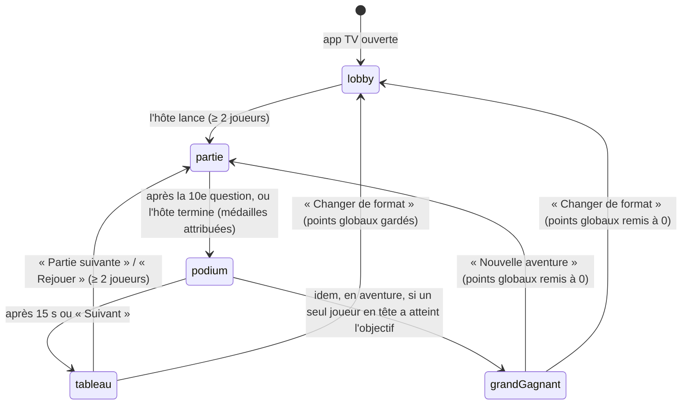
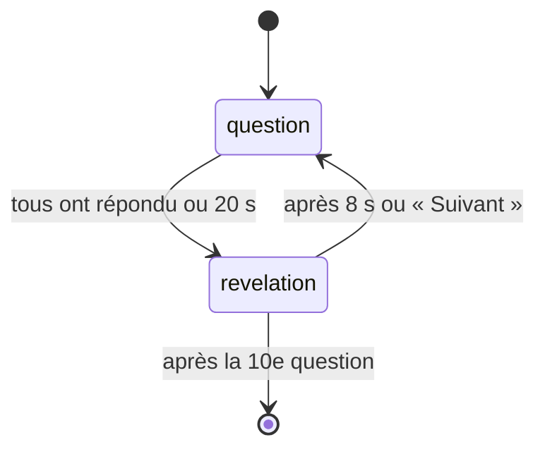

# Quiz TV — Spec du MVP

## Objectif

Le MVP permet à 2 à 10 amis réunis dans une même pièce de jouer une partie complète de quiz de culture générale. La TV (Mi TV Stick 4K) affiche la partie, et chaque téléphone sert de manette via une simple page web, sans rien installer.

Le MVP est réussi si une soirée réelle se déroule sans intervention technique : ouvrir l'app TV, scanner le QR code, jouer 10 questions, voir le podium, puis rejouer. Il doit aussi supporter au moins une déconnexion de téléphone en cours de partie.

Le code et le modèle de données doivent permettre d'ajouter ensuite d'autres modes de jeu sans tout réécrire. Cinq modes sont prévus après le MVP (voir « Modes de jeu supplémentaires »).

## Déroulé d'une partie

Une salle passe par 5 états communs à tous les modes, pilotés par le serveur : `lobby`, `partie`, `podium`, `tableau` et `grandGagnant`. Pendant une partie, le mode a ses propres phases, dans `etatMode.phase`. La TV et les téléphones ne font qu'afficher l'état reçu.



Phases du quiz pendant la partie :



La fermeture après 30 min sans aucune connexion (ni TV ni joueur) peut arriver dans n'importe quel état, pas seulement au podium.

1. **Création de la salle.** À l'ouverture de l'app, la TV demande une salle au serveur. Elle affiche un grand QR code, le code de salle en 4 lettres et la liste des joueurs (vide).
2. **Arrivée des joueurs.** Chaque joueur scanne le QR code (ou tape le code), saisit un pseudo et apparaît sur la TV avec sa couleur. Le premier arrivé devient l'hôte (couronne sur la TV).
3. **Lancement.** L'hôte choisit le mode et le format (« Petite partie » ou « Aventure », voir « Format et médailles »), puis voit un bouton « Lancer la partie », actif dès 2 joueurs connectés.
4. **Question.** La TV affiche la question, les 4 réponses (couleur + forme), le chrono de 20 s et qui a déjà répondu. Les téléphones affichent 4 gros boutons. Un joueur répond une seule fois, sans changer d'avis.
5. **Révélation.** Dès que tous les joueurs attendus ont répondu (voir « Fin anticipée »), ou à la fin du chrono, la TV montre la bonne réponse, le nombre de réponses par choix, qui a eu juste, puis le classement. Chaque téléphone affiche « Bonne réponse, +740 » ou « Raté ».
6. **Enchaînement.** Passage automatique après 8 s. L'hôte peut accélérer avec « Suivant ».
7. **Fin.** Après 10 questions, la TV affiche le podium avec les médailles et les téléphones le rang de chacun.
8. **Tableau.** Après 15 s (ou « Suivant » de l'hôte), la TV affiche les points globaux. En aventure, si un seul joueur en tête a atteint l'objectif, c'est l'écran du grand gagnant à la place.
9. **Rejouer.** L'hôte appuie sur « Partie suivante » (aventure) ou « Rejouer » (petite partie), actif dès 2 joueurs connectés : mêmes joueurs, scores remis à zéro, points globaux gardés, nouvelles questions jamais vues dans cette salle.

## Fonctionnalités du MVP

### Salle
- Création automatique d'une salle à l'ouverture de l'app TV (code de 4 lettres, QR code vers la page joueur)
- 2 à 10 joueurs connectés, 1 joueur autorisé pour tous les modes en mode développeur (`MODE_DEV=1`)
- Rôle d'hôte pour le premier arrivé, transféré automatiquement après 10 s de déconnexion
- Fermeture automatique après 30 min sans aucune connexion, dans n'importe quel état. Tant que la TV est connectée, la salle reste ouverte.
- Jeton secret remis à la TV à la création de la salle, exigé pour s'y reconnecter

### Joueur
- Rejoindre par QR code ou par saisie du code
- Pseudo unique de 1 à 12 caractères, couleur attribuée automatiquement (voir « Couleurs »)
- Reconnexion automatique avec conservation du pseudo et du score
- Écran maintenu allumé pendant la partie (Wake Lock)

### Partie de quiz
- 10 questions tirées au hasard, sans répétition dans la salle
- QCM à 4 choix, chrono de 20 s, points dégressifs selon la rapidité
- Révélation, classement intermédiaire, podium final avec médailles, tableau des points globaux, « Rejouer »

### TV
- App Android TV (APK) : une WebView plein écran qui charge la page TV du serveur
- Écran jamais mis en veille, touche Retour = « Quitter ? », touche OK = recréer une salle
- Reconnexion automatique à sa salle après un rechargement ou une coupure réseau

### Contenu
- Fichier JSON d'environ 200 questions en français, texte uniquement, relues à la main

## Hors périmètre

Ces éléments sont volontairement repoussés. Le modèle de données ne doit pas les empêcher.

- Les modes de jeu autres que le quiz : ils font l'objet de l'étape « Modes de jeu » (tranches 11 à 15), après le MVP
- Le choix d'un thème ou d'une difficulté (les champs existent déjà dans les questions)
- Les questions avec image, son ou vidéo
- Les sons sur les téléphones, et la musique en dehors de la salle d'attente
- Le jeu à distance, hors de la pièce de la TV
- Les comptes, l'historique des parties et toute base de données
- Un back-office pour éditer les questions
- Les langues autres que le français
- La survie des parties à un redémarrage du serveur
- Le pilotage de la partie à la télécommande
- Plus de 10 joueurs et les spectateurs

## Règles des modes

### Quiz culture générale (MVP)

- Une partie compte 10 questions. Chaque question est un QCM à 4 choix avec une seule bonne réponse.
- Chaque joueur a 20 s pour répondre, en une seule réponse définitive.
- Une mauvaise réponse ou une absence de réponse rapporte 0 point.
- Une bonne réponse rapporte entre 1000 et 500 points selon la rapidité :

  `points = arrondi(1000 - 500 × t / 20)`

  Ici, `t` est le temps écoulé en secondes, mesuré par le serveur à la réception de la réponse. On n'utilise jamais l'horloge du téléphone.
- **Fin anticipée** : la manche se termine dès que tous les joueurs attendus ont répondu, ou à 20 s. Les joueurs attendus sont ceux qui étaient connectés au début de la manche et qui le sont encore. Un joueur arrivé en cours de manche n'est pas attendu. Si un joueur attendu se déconnecte, on vérifie à nouveau si tous les autres ont répondu.
- Classement par score total. En cas d'égalité, les joueurs partagent le même rang, sans départage, et le rang suivant est sauté : 1, 1, 3.

### Format et médailles (tous les modes)

- **Format**, choisi par l'hôte en salle d'attente : « Petite partie » (par défaut) ou « Aventure », avec un objectif de 3 à 15 points globaux (5 par défaut).
- **Médailles** à la fin de chaque partie, quel que soit le mode, y compris quand l'hôte la termine avant la fin (sur les scores du moment) : or = 3 points globaux, argent = 2, bronze = 1. Classement « olympique » : les ex æquo partagent la même médaille et le rang suivant est sauté (1, 1, 3 → or, or, bronze ; 1, 2, 2 → or, argent, argent). Un joueur à 0 point dans la partie n'a pas de médaille, même s'il est sur le podium.
- **Points globaux** : ils s'additionnent de partie en partie dans la salle, avec le nombre de médailles de chaque sorte. « Rejouer » et « Changer de format » les gardent. Un joueur qui arrive en cours de route part de 0.
- **Fin d'une aventure** : après les médailles, si un seul joueur a le plus de points globaux et au moins l'objectif, il est le grand gagnant. Si plusieurs joueurs sont à égalité en tête à l'objectif ou au-delà, on joue une partie de plus (« Départage ! » sur le tableau).
- **Nouvelle aventure** (ou « Changer de format » après un grand gagnant) : points globaux, médailles et numéro de partie remis à 0, même objectif.

### Modes de jeu supplémentaires (après le MVP)

Résumés seulement. Les règles détaillées de chaque mode sont écrites dans sa mini-spec (`docs/modes/`), juste avant de le coder. Le maximum reste 10 joueurs pour tous les modes.

| Ordre | Mode | Joueurs | Résumé |
|---|---|---|---|
| 1 | **Estimation** (disponible, voir `docs/modes/estimation.md`) | 3 à 10 | Une question à réponse numérique (« Combien de km entre Casablanca et Paris ? »). Chacun saisit un nombre, le plus proche gagne. |
| 2 | **Qui de nous ?** (disponible, voir `docs/modes/qui-de-nous.md`) | 4 à 10 | « Qui est le plus susceptible de rater son avion ? ». Chacun vote pour un joueur, la TV affiche les résultats. |
| 3 | **Undercover** (disponible, voir `docs/modes/undercover.md`) | 4 à 10 | Chacun reçoit un mot secret sur son téléphone : les undercovers ont un mot légèrement différent, Mister White (dès 5 joueurs) n'en a aucun. Tours de description à voix haute, puis vote pour éliminer les intrus. Mister White éliminé peut gagner en devinant le mot des civils. |
| 4 | **Même réponse** (disponible, voir `docs/modes/meme-reponse.md`) | 3 à 10 | « Cite un fruit rouge ». On marque des points si on donne la même réponse que d'autres joueurs. |
| 5 | **Le bluff** | 4 à 10 | Question obscure : chacun invente une fausse réponse, puis tout le monde cherche la vraie parmi les bluffs. Points pour avoir trouvé et pour avoir piégé. |

## Cas limites

| Situation | Comportement |
|---|---|
| Joueur déconnecté pendant une partie | Grisé sur la TV, garde son score et son pseudo (réservé), ne bloque pas la manche. Jamais supprimé pendant une partie. |
| Joueur déconnecté en salle d'attente | Retiré de la salle après 10 s de déconnexion, avec ses points globaux (y compris après « Changer de format »). |
| Joueur déconnecté au podium, au tableau ou au grand gagnant | Comme pendant une partie : jamais retiré, garde ses points globaux et ses médailles. |
| Joueur qui revient | Retrouve pseudo et score grâce à son identifiant mémorisé, et reprend à l'écran en cours. |
| Joueur retiré de la salle d'attente qui revient | Réinscrit automatiquement avec son pseudo mémorisé, comme un nouveau joueur. Si ce pseudo a été pris entre-temps, il revient au formulaire avec « Pseudo déjà pris ». |
| Hôte déconnecté plus de 10 s | Dans tous les états, le rôle passe au joueur connecté arrivé le plus tôt (`arriveeA`). Si aucun autre joueur n'est connecté, l'hôte ne change pas, et le rôle passe au premier joueur qui se connecte ensuite. L'ancien hôte ne récupère pas le rôle à son retour. En salle d'attente, l'hôte seul est retiré comme les autres, et le prochain joueur qui arrive devient l'hôte. |
| Arrivée en cours de partie | Acceptée avec 0 point, joue à partir de la question suivante. Le QR code reste visible dans un coin. Il en va de même pour un joueur déconnecté au début d'une manche qui revient pendant celle-ci. |
| Reconnexion alors que 10 joueurs sont connectés | Toujours acceptée : un joueur ne perd jamais sa place. |
| Plus de couleur libre (11e joueur pendant qu'un autre est déconnecté) | Le nouveau joueur reprend la couleur d'un joueur déconnecté. |
| Pseudo déjà pris | Message « Pseudo déjà pris », saisie à refaire. Les espaces de début et de fin sont retirés, et la comparaison ignore la casse (« paul » = « Paul »). |
| 11e joueur | Message « Salle pleine (10 max) ». Seuls les joueurs connectés comptent. |
| Code de salle inconnu ou salle fermée | Message « Salle introuvable ». |
| Moins de 2 joueurs connectés en cours de partie | La partie continue. |
| TV rechargée ou coupée | La TV se reconnecte à sa salle et reprend l'état en cours. |
| Serveur redémarré | Partie perdue. La TV recrée une salle et les joueurs voient « Salle introuvable ». |
| Plus assez de questions inédites | On réautorise les questions déjà vues, en commençant par les plus anciennes. |

## Format des données

Toutes les salles vivent en mémoire sur le serveur, dans un objet `salles` indexé par code. Le champ `mode` et le bloc `etatMode` isolent ce qui est propre au quiz : un nouveau mode ajoute son propre `etatMode` sans toucher au reste. Le serveur passe par un registre des modes (`server/modes/index.js`), et chaque mode respecte le même contrat (voir `docs/modes/estimation.md`).

### Question (fichier `questions.json`)

```json
{
  "id": "q0042",
  "texte": "Quelle est la capitale de l'Australie ?",
  "reponses": ["Sydney", "Canberra", "Melbourne", "Perth"],
  "bonneReponse": 1,
  "categorie": "geographie",
  "difficulte": 2
}
```

`bonneReponse` est l'index de la bonne réponse (de 0 à 3). L'ordre d'affichage est mélangé à chaque tirage, et `bonneReponse` est alors recalculé pour pointer vers la même réponse. Un test automatique vérifie ce recalcul. La `difficulte` va de 1 (facile) à 3 (difficile).

### Joueur

```json
{
  "id": "j_8f3k2a",
  "pseudo": "Paul",
  "couleur": 1,
  "score": 2740,
  "pointsGlobaux": 7,
  "medailles": { "or": 2, "argent": 0, "bronze": 1 },
  "connecte": true,
  "socketId": "aXc91...",
  "arriveeA": 1758641000000
}
```

`score` est celui de la partie en cours, remis à 0 à chaque lancement. `pointsGlobaux` et `medailles` s'accumulent de partie en partie (voir « Format et médailles »). `id` est généré par le serveur et mémorisé dans le navigateur du téléphone : c'est lui qui permet la reconnexion. `couleur` est un numéro de 1 à 10 : la teinte réelle est définie dans le CSS (`--joueur-1` à `--joueur-10`, voir « Couleurs »). `socketId` change à chaque reconnexion. `arriveeA` sert à choisir le prochain hôte.

### Salle

```json
{
  "code": "KDZP",
  "mode": "quiz",
  "etat": "partie",
  "hoteId": "j_8f3k2a",
  "tvSocketId": "Zp0e4...",
  "jetonTv": "t_91kd02mz4q...",
  "joueurs": ["...objets Joueur..."],
  "questionsVues": ["q0042", "q0107"],
  "derniereActiviteA": 1758641200000,
  "format": { "type": "aventure", "objectif": 5 },
  "numeroPartie": 3,
  "grandGagnantId": null,
  "debutPodiumA": 1758641100000,
  "medaillesPartie": { "j_8f3k2a": "or" },
  "etatMode": {
    "phase": "question",
    "questions": ["...10 questions tirées..."],
    "indexQuestion": 3,
    "debutQuestionA": 1758641190000,
    "reponses": { "j_8f3k2a": { "choix": 1, "recuA": 1758641195300 } }
  }
}
```

`etat` vaut `lobby`, `partie`, `podium`, `tableau` ou `grandGagnant`. Pendant une partie, `etatMode.phase` vaut `question` ou `revelation` pour le quiz. Les timers (20 s, 8 s, 15 s de podium, 10 s pour l'hôte et pour le retrait d'un joueur en salle d'attente) sont gérés par le serveur.

`format.type` vaut `petite` ou `aventure`, et `format.objectif` va de 3 à 15. `numeroPartie` compte les parties lancées depuis la création de la salle ou la dernière nouvelle aventure. `medaillesPartie` donne la médaille (`or`, `argent`, `bronze`) de chaque joueur médaillé de la dernière partie. `grandGagnantId` n'est rempli qu'à l'état `grandGagnant`. Ces champs sont communs à tous les modes : le code commun (`server/salles.js`, `server/medailles.js`) les gère sans jamais lire `etatMode`.

`jetonTv` est un secret aléatoire généré à la création de la salle et envoyé uniquement à la TV. Il empêche un joueur de se faire passer pour la TV avec le seul code de salle, puis de lire les bonnes réponses et les `id` des joueurs.

### Événements Socket.IO

Règle simple : les clients envoient des actions, le serveur répond en diffusant l'état complet de la salle. Pas de synchronisation fine, et la reconnexion devient triviale.

| Événement | Sens | Contenu |
|---|---|---|
| `tv:creer` | TV → serveur | code et `jetonTv` de l'ancienne salle, facultatifs, pour s'y reconnecter. Sans jeton valide, une nouvelle salle est créée. |
| `joueur:rejoindre` | téléphone → serveur | code, pseudo, id mémorisé éventuel |
| `hote:lancer` | téléphone de l'hôte → serveur | rien |
| `joueur:repondre` | téléphone → serveur | index du choix |
| `hote:suivant` | téléphone de l'hôte → serveur | rien. Pendant une partie, le « Suivant » du mode. Au podium, passe au tableau (ou au grand gagnant). |
| `hote:rejouer` | téléphone de l'hôte → serveur | rien. Accepté au tableau et au grand gagnant. Relance le mode choisi ; depuis le grand gagnant, remet d'abord les points globaux à 0 (« Nouvelle aventure »). |
| `hote:configurer` | téléphone de l'hôte → serveur | `{ type: "petite" \| "aventure", objectif }`. Accepté seulement en salle d'attente, avec un objectif entier de 3 à 15. |
| `hote:changerFormat` | téléphone de l'hôte → serveur | rien. Accepté au tableau et au grand gagnant : retour en salle d'attente. |
| `hote:choisirMode` | téléphone de l'hôte → serveur | `id` du mode. Accepté seulement en salle d'attente ou au tableau, pour un mode jouable avec assez de joueurs connectés (voir `docs/modes/estimation.md`). |
| `hote:terminer` | téléphone de l'hôte → serveur | rien. Arrête la partie en cours et passe au podium. |
| `salle:etat` | serveur → TV | état complet de la salle, avec le texte des questions et le `jetonTv`. `bonneReponse` n'y figure qu'à partir de la révélation. Hors partie, aussi `tableau` (joueurs triés par points globaux, avec rang, médailles et `ecartAuLeader`), `departage` et `pointsMedaille`. |
| `joueur:etat` | serveur → un téléphone | vue personnalisée : mode, écran à afficher, a déjà répondu, résultat, rang, est hôte, `peutTerminer` (hôte pendant une partie). Hors partie, aussi `format` et `pointsGlobaux` ; au podium `medaille` et `gain` ; au tableau et au grand gagnant `rangGlobal`, `numeroPartie`, `grandGagnant` et `estGrandGagnant`. |
| `erreur` | serveur → client | code + message (pseudo pris, salle pleine, salle introuvable) |

Ni le téléphone ni la TV ne reçoivent la bonne réponse avant la révélation, pour éviter la triche via les outils du navigateur.

## Écrans à concevoir

Principe : l'information est sur la TV, le téléphone ne montre que ce qu'il faut pour agir. La TV doit rester lisible à 3 mètres (texte de 40 px minimum en 1080p). Les écrans du téléphone doivent s'utiliser d'une main.

### TV (1920×1080)

| Écran | Contenu |
|---|---|
| Chargement | « Réveil du serveur… » avec nouvelle tentative automatique (voir Contraintes techniques) |
| Salle d'attente | QR code géant, code en 4 lettres, URL courte, joueurs arrivés (couleur, pseudo, couronne de l'hôte), mode choisi et sa règle courte (« N joueurs minimum » s'il en manque), format (« Petite partie » ou « Aventure — premier à 5 points »), « En attente que l'hôte lance » |
| Question | Numéro (3/10), texte, 4 réponses (couleur + forme ▲ ◆ ● ■), chrono, pastilles des joueurs ayant répondu, petit QR code dans un coin |
| Révélation | Bonne réponse mise en avant, nombre de réponses par choix, qui a eu juste, puis classement avec les points gagnés |
| Podium | Tous les joueurs de rang 3 ou mieux (ex æquo possibles, donc parfois plus de 3) avec leur médaille, classement complet dessous avec « 🥇 +3 / 🥈 +2 / 🥉 +1 », « Points globaux dans un instant » |
| Tableau | Joueurs triés par points globaux (rang, pseudo, médailles obtenues 🥇🥈🥉, points), « Après la partie N ». En aventure : l'objectif, l'écart au leader et « Départage ! » en cas d'égalité en tête à l'objectif. « Prochain mode : … », « L'hôte peut relancer » |
| Grand gagnant | Nom du grand gagnant en grand, classement final de l'aventure, « L'hôte peut lancer une nouvelle aventure » |
| Quitter ? | Boîte de confirmation déclenchée par la touche Retour |

### Téléphone (portrait)

| Écran | Contenu |
|---|---|
| Rejoindre | Code pré-rempli depuis le QR code, champ pseudo, bouton « Entrer », messages d'erreur |
| Attente | « Tu es dans la salle », sa couleur. Pour l'hôte : « Petite partie » / « Aventure » (et en aventure le réglage − / + de l'objectif), un bouton par mode (grisé s'il manque des joueurs, « Bientôt » s'il n'est pas encore codé), puis « Lancer la partie » (inactif sous le minimum du mode choisi). Pour les autres : « Mode : … » et le format |
| Répondre | 4 gros boutons couleur + forme, sans texte, qui occupent tout l'écran |
| Réponse envoyée | « Réponse envoyée, regarde la TV » avec le bouton choisi |
| Résultat | « Bonne réponse, +740 » ou « Raté », rang actuel. Pour l'hôte : bouton « Suivant » |
| Fin | Rang final, score, médaille et points globaux gagnés (« 🥇 Médaille d'or, +3 » ou « Pas de médaille cette fois »). Pour l'hôte : « Suivant » |
| Tableau | Rang et points globaux. Pour l'hôte : les boutons de mode, « Partie suivante » (aventure) ou « Rejouer » (petite partie), inactif sous le minimum du mode choisi, et « Changer de format ». Pour les autres : « Mode : … » |
| Grand gagnant | « Tu gagnes l'aventure ! » ou « X gagne l'aventure », rang et points globaux. Pour l'hôte : « Nouvelle aventure » et « Changer de format » |
| En attente de la prochaine question | Pour un joueur arrivé en cours de manche |
| Reconnexion | Bandeau « Reconnexion… » quand la connexion saute |

### Couleurs

Ambiance « Pop et coloré » (choisie à la tranche 7) : fond crème à pois, gros contours foncés, relief par une bordure basse épaisse, police Fredoka hébergée dans le dépôt. Toutes les couleurs sont des variables dans `public/commun/theme.css` : changer d'ambiance revient à modifier ce seul fichier. Les réponses ne sont jamais identifiées par la couleur seule : la forme (dessinée en SVG) les distingue toujours.

Fond `#FFF1CC`, texte et contours `#1B1035`, accent `#FF4F8B`.

Réponses :

| Forme | Couleur |
|---|---|
| ▲ | Rouge `#F2353F` |
| ◆ | Bleu `#2F6BFF` |
| ● | Jaune `#FFC01F` (forme et texte foncés) |
| ■ | Vert `#17A34A` |

Joueurs, attribués dans cet ordre (première couleur libre). Le serveur n'envoie que le numéro.

| # | Couleur |
|---|---|
| 1 | Orange `#FF7A00` |
| 2 | Rose `#FF4FA0` |
| 3 | Violet `#8A4DFF` |
| 4 | Cyan `#00B4C6` |
| 5 | Menthe `#19C37D` |
| 6 | Citron vert `#8BC000` |
| 7 | Brun `#9A5B34` |
| 8 | Encre `#1B1035` |
| 9 | Bleu ciel `#3E9BFF` |
| 10 | Gris `#7B8190` |

## Contraintes techniques

### Mi TV Stick 4K et APK

- Android TV 11 et 2 Go de RAM : la page TV reste en HTML/CSS/JS sans framework, avec des animations CSS simples (opacité, déplacement) et aucune image lourde.
- L'APK est une coquille minimale en Kotlin :
  - une activité plein écran avec une WebView qui charge l'URL de la page TV, sans code métier ;
  - l'écran reste allumé (`FLAG_KEEP_SCREEN_ON`) ;
  - l'app est déclarée pour Android TV (catégorie Leanback + bannière), sinon elle n'apparaît pas sur l'accueil du stick ;
  - les touches Retour et OK sont transmises à la page.
- Toute modification d'affichage se fait côté serveur. On ne réinstalle l'APK que si la coquille change.
- Mettre à jour « Android System WebView » via le Play Store du stick avant les tests.
- Installation de l'APK : on active les options développeur et les sources inconnues, puis on transfère l'APK via l'app « Send Files to TV » ou via ADB en Wi-Fi. C'est détaillé dans une tranche dédiée.
- Avant l'APK, on peut tester la page TV dans le navigateur d'un ordinateur branché à la TV.

### Hébergement : Render gratuit pour commencer

Décision : offre gratuite de Render pour le développement et les premières soirées. On passera à une offre payante si les limites gênent. Il n'y a rien à réécrire pour migrer : c'est un simple serveur Node.

Limites connues (doc Render) :

- Mise en veille après 15 min sans requête HTTP ni message WebSocket entrant, puis environ 1 min de réveil. Le premier lancement de la soirée attend donc ~1 min.
  - Parade : l'APK affiche d'abord une page locale « Réveil du serveur… » qui interroge `/sante` toutes les 3 s, puis charge la page TV.
  - Pendant une partie, les échanges Socket.IO (ping/pong toutes les 25 s par défaut) devraient empêcher la mise en veille. À vérifier en conditions réelles, salle d'attente ouverte plus de 15 min.
- Redémarrages possibles à tout moment, et fichiers locaux effacés : cohérent avec le choix « tout en mémoire, partie perdue si redémarrage ». `questions.json` est versionné dans le dépôt, donc il n'est pas concerné.
- 750 h gratuites par mois : suffisant pour un seul service.

### Réseau et navigateurs

- HTTPS obligatoire en production : l'API Wake Lock ne fonctionne qu'en HTTPS. En développement local (http sur le Wi-Fi), elle est simplement ignorée.
- Page joueur testée sur Chrome Android et Safari iOS récents.
- Socket.IO gère les reconnexions. L'identité du joueur repose sur son `id` mémorisé dans le `localStorage`, pas sur le socket.
- Une coupure réelle (4G perdue, écran verrouillé) est détectée par le serveur en 20 s au plus (`pingInterval` et `pingTimeout` de Socket.IO à 10 s). Le délai de 10 s ne démarre qu'après cette détection.
- La TV mémorise son code et son `jetonTv` dans le `sessionStorage` : un rechargement ou une coupure retrouve la salle, un nouvel onglet ou l'app relancée en crée une nouvelle.
- Tests à plusieurs onglets : avec le paramètre `?dev` dans l'URL de la page joueur, l'`id` est mémorisé dans le `sessionStorage` au lieu du `localStorage`. Chaque onglet devient ainsi un joueur distinct.

### Configuration

| Variable d'environnement | Rôle | Par défaut |
|---|---|---|
| `URL_PUBLIQUE` | Adresse de base encodée dans le QR code et affichée sous celui-ci | L'IP locale du PC sur le Wi-Fi (par exemple `http://192.168.1.20:3000`), pour que les téléphones puissent l'ouvrir |
| `MODE_DEV` | `1` autorise une partie à 1 joueur dans tous les modes (lancer, rejouer, choisir le mode) | Désactivé |

Dépendance validée pour le QR code : `qrcode`.

## Tranches de développement

On découpe en 17 tranches. Chacune se termine par un test concret. La TV est simulée par un onglet de navigateur jusqu'à la tranche 9.

Ordre de réalisation : 1, 2, 3, 4, 5, **8**, 6, 7, **11, 12, 13** (modes de jeu), **16** (sons), **14** (mode de jeu), **17** (médailles et aventure), **15** (mode de jeu), 9, 10. Les tranches 9 (APK) et 10 (soirée test) sont repoussées après les modes de jeu. Le PC de développement est sur un réseau d'entreprise : les téléphones ne peuvent pas joindre un serveur local. Le déploiement sur Render (tranche 8) passe donc avant la tranche 6, pour que les tests sur vrais téléphones se fassent toujours sur le serveur en ligne. Les numéros des tranches ne changent pas.

- **1. Squelette.** Serveur Node + Express + Socket.IO, pages `/tv` et `/joueur` vides, route `/sante`.
  *Test : un message tapé dans l'onglet joueur s'affiche dans l'onglet TV.*
- **2. Salle d'attente.** Création de salle (code de 4 lettres + QR code), rejoindre avec un pseudo, liste des joueurs en direct, hôte = premier arrivé, erreurs (pseudo pris, salle pleine, salle introuvable).
  *Test : 3 onglets joueurs (avec `?dev`) apparaissent sur la TV, et un 2e « Paul » (ou « paul ») est refusé.*
- **3. Boucle de quiz minimale.** L'hôte lance, 3 questions écrites en dur, les joueurs répondent, révélation, « Suivant » manuel, fin. Mode développeur à 1 joueur (`MODE_DEV=1`).
  *Test : partie complète seul, en 2 onglets.*
- **4. Règles complètes.** Chrono 20 s côté serveur, fin anticipée, points dégressifs, enchaînement automatique après 8 s, classement avec ex æquo, podium, « Rejouer ».
  *Test : les scores correspondent à la formule, et une égalité donne le même rang.*
- **5. Banque de questions.** `questions.json` d'environ 200 questions (générées avec Claude, relues par Paul), tirage sans répétition dans la salle, mélange de l'ordre des réponses (avec test automatique du recalcul de `bonneReponse`), script qui vérifie le format du fichier.
  *Test : 3 parties d'affilée sans aucune question répétée.*
- **8. Déploiement Render** (réalisée juste après la tranche 5). Dépôt GitHub, service gratuit, HTTPS, vérification de la mise en veille pendant une salle d'attente longue.
  *Test : jouer avec un téléphone en 4G.*
- **6. Robustesse.** Reconnexion des joueurs, transfert de l'hôte après 10 s, arrivée en cours de partie, reconnexion de la TV, fermeture des salles après 30 min.
  - Boutons de test sur la page joueur, visibles seulement avec `?dev` : « Couper la connexion 5 s » et « Couper 15 s ». Ils coupent le socket puis le rétablissent après ce délai, ce qui simule une coupure sans avoir à verrouiller un téléphone. 5 s reste sous le seuil de 10 s (l'hôte et le joueur en salle d'attente sont conservés), 15 s le dépasse.
  - Tests automatiques de scénarios avec le temps simulé (`mock.timers` de `node:test`), sans attendre les vrais délais : reconnexion d'un joueur avec conservation du pseudo et du score, retrait d'un joueur déconnecté en salle d'attente après 10 s, transfert de l'hôte après 10 s (et pas avant), pas de transfert si aucun autre joueur n'est connecté, fermeture d'une salle après 30 min sans connexion.
  *Test : sur Render, avec de vrais téléphones en 4G et des onglets `?dev` sur le PC : couper un joueur 5 s puis 15 s, couper l'hôte plus de 10 s, recharger la TV.*
- **7. Habillage.** Design TV lisible à 3 mètres, boutons couleur + forme, écrans d'attente et de résultat, Wake Lock.
  - Mise à l'échelle de la page TV : elle reste conçue en 1920×1080, mais elle est réduite ou agrandie en bloc pour tenir entière dans la fenêtre, centrée et sans déformation. Cela évite de zoomer quand le navigateur offre moins de place (écran de PC avec mise à l'échelle Windows à 125 %, WebView du stick qui voit souvent 960×540). Le facteur est calculé en JavaScript (`ajusterEchelle()`), au chargement et à chaque redimensionnement, car le calcul en CSS pur demande des fonctions trop récentes pour la WebView d'Android TV 11.
  - Arrêt de la partie par l'hôte : un bouton « Terminer la partie » sur le téléphone de l'hôte, pendant une question ou une révélation, avec une confirmation pour éviter un appui accidentel. Le téléphone envoie `hote:terminer`, le serveur vérifie que l'émetteur est bien l'hôte et passe directement au podium avec les scores actuels. Une manche en cours n'est pas comptée. « Rejouer » reste disponible ensuite.
  *Test : partie à 4 sur la vraie TV, via l'ordinateur branché. La page TV s'affiche en entier sans zoom du navigateur, quelle que soit la taille de la fenêtre. L'hôte termine une partie à la 4e question : la TV affiche le podium, un autre joueur ne peut pas terminer.*

### Étape « Modes de jeu » (tranches 11 à 15)

Cinq modes ajoutés un par un, dans l'ordre ci-dessous (résumés dans « Modes de jeu supplémentaires »). Chaque mode est testé dans le navigateur via Render : TV dans un onglet du PC, joueurs sur de vrais téléphones et sur des onglets `?dev`.

Règles de l'étape :

- **Une mini-spec par mode**, dans `docs/modes/<mode>.md`, écrite et validée avant de coder le mode. Elle précise au moins : les règles et le calcul des points, les phases de jeu et les chronos, les événements et leur contenu, ce que voient la TV et chaque téléphone (et ce qu'ils ne doivent jamais recevoir), le contenu à préparer (fichier de données et script de vérification), les cas limites (déconnexion, arrivée en cours de partie, joueurs sous le minimum en cours de partie, arrêt par l'hôte) et les tests automatiques.
- **Contraintes du Mi TV Stick** (voir « Contraintes techniques ») : animations CSS simples (opacité, déplacement), pas de flou (`filter: blur`, `backdrop-filter`), pas d'images lourdes.
- Les règles d'architecture restent valables : serveur autoritaire, temps mesuré par le serveur, aucune information secrète envoyée avant la révélation, actions `hote:*` vérifiées côté serveur, ce qui est propre à un mode reste dans `etatMode` et `server/modes/<mode>.js`.
- Le quiz reste disponible et continue de marcher à chaque tranche.

Tranches :

- **11. Choix du mode + Estimation.** L'hôte choisit le mode depuis son téléphone, en salle d'attente et à la fin d'une partie. Un mode est grisé tant qu'il n'y a pas assez de joueurs connectés. La TV affiche le mode choisi. Puis le mode Estimation (3 à 10 joueurs).
  *Test : défini dans `docs/modes/estimation.md`.*
- **12. Qui de nous ?** (4 à 10 joueurs).
  *Test : défini dans `docs/modes/qui-de-nous.md`.*
- **13. Undercover** (4 à 10 joueurs).
  *Test : défini dans `docs/modes/undercover.md`.*
- **14. Même réponse** (3 à 10 joueurs).
  *Test : défini dans `docs/modes/meme-reponse.md`.*
- **15. Le bluff** (4 à 10 joueurs).
  *Test : défini dans `docs/modes/bluff.md`.*

### Tranche « Sons » (réalisée après la tranche 13)

- **16. Sons.** Sons synthétisés par le navigateur (Web Audio API, aucun fichier audio) et joués par la TV seulement, musique de fond en salle d'attente, planche de sons `/tv?sons`.
  *Test : défini dans `docs/sons.md`.*

### Tranche « Médailles et aventure » (réalisée après la tranche 14)

- **17. Médailles, points globaux et format « Aventure ».** Choix du format en salle d'attente, médailles de fin de partie (fonction pure `attribuerMedailles` dans `server/medailles.js`, avec tests), points globaux, états `tableau` et `grandGagnant`, passage automatique du podium au tableau après 15 s. Règles dans « Format et médailles ».
  *Test : en local avec 3 onglets `?dev`, une aventure à 3 points jusqu'au grand gagnant, en vérifiant médailles et totaux à chaque tableau ; une égalité en tête (plus simple en Même réponse) donne des médailles partagées ; un joueur coupé pendant le tableau revient avec ses points globaux ; en petite partie, « Rejouer » garde les points globaux et « Changer de format » ramène à la salle d'attente.*

### Fin du projet

- **9. APK Android TV.** Coquille WebView avec page « Réveil du serveur… », touches Retour/OK, lecture du son sans geste dans la WebView (`mediaPlaybackRequiresUserGesture = false`, voir `docs/sons.md`), installation sur le stick pas à pas.
  *Test : lancer l'app depuis l'accueil du stick et jouer une partie, avec le son.*
- **10. Soirée test.** Une vraie soirée avec des amis, en notant les bugs et les frictions. Ces retours décideront si on migre vers une offre payante et quels modes améliorer en priorité.

## Questions ouvertes

- Nom définitif du jeu, affiché sur la TV et dans l'accueil du stick
- URL courte à afficher sous le QR code : l'adresse onrender.com par défaut ou un nom de domaine à toi ?
