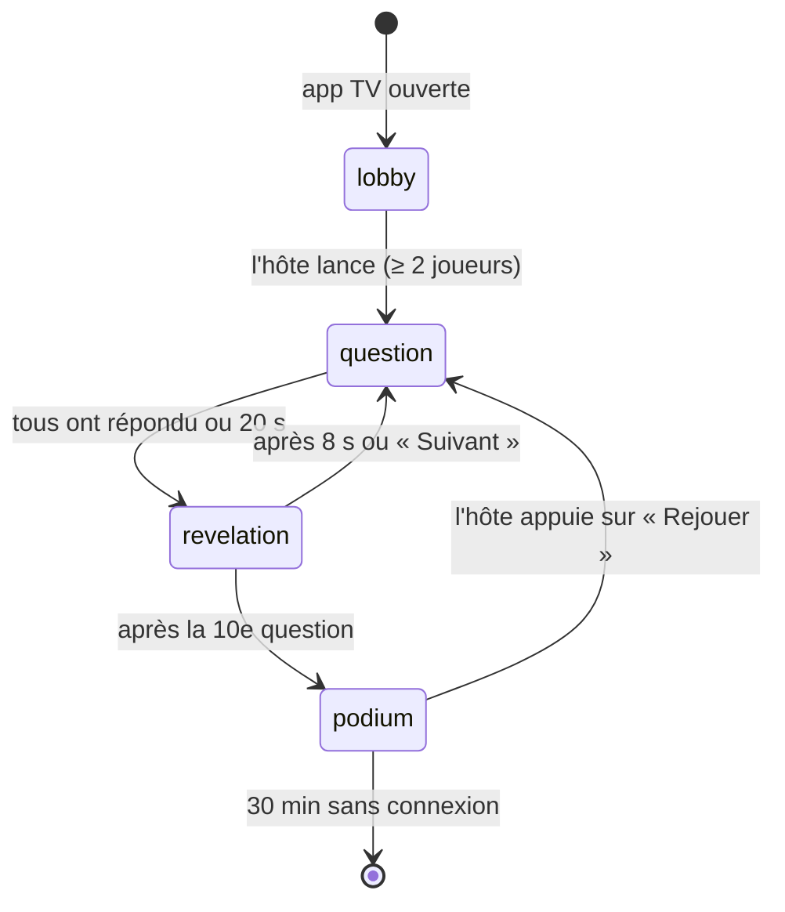

# Quiz TV — Spec du MVP

## Objectif

Le MVP permet à 2 à 10 amis réunis dans une même pièce de jouer une partie complète de quiz de culture générale. La TV (Mi TV Stick 4K) affiche la partie, et chaque téléphone sert de manette via une simple page web, sans rien installer.

Le MVP est réussi si une soirée réelle se déroule sans intervention technique : ouvrir l'app TV, scanner le QR code, jouer 10 questions, voir le podium, puis rejouer. Il doit aussi supporter au moins une déconnexion de téléphone en cours de partie.

Le code et le modèle de données doivent permettre d'ajouter ensuite les modes « Fausses réponses », « L'imposteur » et « Qui de nous… ? » sans tout réécrire.

## Déroulé d'une partie

Une salle passe par 4 états, pilotés par le serveur. La TV et les téléphones ne font qu'afficher l'état reçu.



1. **Création de la salle.** À l'ouverture de l'app, la TV demande une salle au serveur. Elle affiche un grand QR code, le code de salle en 4 lettres et la liste des joueurs (vide).
2. **Arrivée des joueurs.** Chaque joueur scanne le QR code (ou tape le code), saisit un pseudo et apparaît sur la TV avec sa couleur. Le premier arrivé devient l'hôte (couronne sur la TV).
3. **Lancement.** L'hôte voit un bouton « Lancer la partie », actif dès 2 joueurs connectés.
4. **Question.** La TV affiche la question, les 4 réponses (couleur + forme), le chrono de 20 s et qui a déjà répondu. Les téléphones affichent 4 gros boutons. Un joueur répond une seule fois, sans changer d'avis.
5. **Révélation.** Dès que tous les joueurs connectés ont répondu, ou à la fin du chrono, la TV montre la bonne réponse, le nombre de réponses par choix, qui a eu juste, puis le classement. Chaque téléphone affiche « Bonne réponse, +740 » ou « Raté ».
6. **Enchaînement.** Passage automatique après 8 s. L'hôte peut accélérer avec « Suivant ».
7. **Fin.** Après 10 questions, la TV affiche le podium et les téléphones le rang de chacun.
8. **Rejouer.** L'hôte appuie sur « Rejouer » : mêmes joueurs, scores remis à zéro, nouvelles questions jamais vues dans cette salle.

## Fonctionnalités du MVP

### Salle
- Création automatique d'une salle à l'ouverture de l'app TV (code de 4 lettres, QR code vers la page joueur)
- 2 à 10 joueurs, 1 joueur autorisé en mode développeur
- Rôle d'hôte pour le premier arrivé, transféré automatiquement s'il se déconnecte
- Fermeture automatique après 30 min sans aucune connexion

### Joueur
- Rejoindre par QR code ou par saisie du code
- Pseudo unique de 1 à 12 caractères, couleur attribuée automatiquement
- Reconnexion automatique avec conservation du pseudo et du score
- Écran maintenu allumé pendant la partie (Wake Lock)

### Partie de quiz
- 10 questions tirées au hasard, sans répétition dans la salle
- QCM à 4 choix, chrono de 20 s, points dégressifs selon la rapidité
- Révélation, classement intermédiaire, podium final, « Rejouer »

### TV
- App Android TV (APK) : une WebView plein écran qui charge la page TV du serveur
- Écran jamais mis en veille, touche Retour = « Quitter ? », touche OK = recréer une salle
- Reconnexion automatique à sa salle après un rechargement ou une coupure réseau

### Contenu
- Fichier JSON d'environ 200 questions en français, texte uniquement, relues à la main

## Hors périmètre

Ces éléments sont volontairement repoussés. Le modèle de données ne doit pas les empêcher.

- Les modes « Fausses réponses », « L'imposteur » et « Qui de nous… ? »
- Le choix d'un thème ou d'une difficulté (les champs existent déjà dans les questions)
- Les questions avec image, son ou vidéo
- Le son et la musique (chrono, jingles)
- Le jeu à distance, hors de la pièce de la TV
- Les comptes, l'historique des parties et toute base de données
- Un back-office pour éditer les questions
- Les langues autres que le français
- La survie des parties à un redémarrage du serveur
- Le pilotage de la partie à la télécommande
- Plus de 10 joueurs et les spectateurs

## Règles des modes

### Quiz culture générale (MVP)

- Une partie compte 10 questions. Chaque question est un QCM à 4 choix avec une seule bonne réponse.
- Chaque joueur a 20 s pour répondre, en une seule réponse définitive.
- Une mauvaise réponse ou une absence de réponse rapporte 0 point.
- Une bonne réponse rapporte entre 1000 et 500 points selon la rapidité :

  `points = arrondi(1000 - 500 × t / 20)`

  Ici, `t` est le temps écoulé en secondes, mesuré par le serveur à la réception de la réponse. On n'utilise jamais l'horloge du téléphone.
- La manche se termine dès que tous les joueurs connectés ont répondu, ou à 20 s.
- Classement par score total. En cas d'égalité, les joueurs partagent le même rang, sans départage.

### Modes futurs (hors MVP, intentions à préciser)

- **Fausses réponses** : chaque joueur invente une fausse réponse à une question peu connue, puis tous votent parmi les fausses réponses et la vraie. On marque des points en trouvant la vraie et en piégeant les autres.
- **L'imposteur** : tous reçoivent le même mot sauf un joueur. Chacun donne un indice, puis on vote pour démasquer l'imposteur.
- **Qui de nous… ?** : une question du type « Qui de nous est le plus susceptible de… ». Chacun vote pour un joueur, et on marque en votant comme la majorité.

## Cas limites

| Situation | Comportement |
|---|---|
| Joueur déconnecté | Grisé sur la TV, garde son score, ne bloque pas la manche. Jamais supprimé pendant une partie. |
| Joueur qui revient | Retrouve pseudo et score grâce à son identifiant mémorisé, et reprend à l'écran en cours. |
| Hôte absent plus de 10 s | Le rôle passe au joueur connecté arrivé juste après. L'ancien hôte ne le récupère pas à son retour. |
| Arrivée en cours de partie | Acceptée avec 0 point, joue à partir de la question suivante. Le QR code reste visible dans un coin. |
| Pseudo déjà pris | Message « Pseudo déjà pris », saisie à refaire. |
| 11e joueur | Message « Salle pleine (10 max) ». |
| Code de salle inconnu ou salle fermée | Message « Salle introuvable ». |
| Moins de 2 joueurs connectés en cours de partie | La partie continue. |
| TV rechargée ou coupée | La TV se reconnecte à sa salle et reprend l'état en cours. |
| Serveur redémarré | Partie perdue. La TV recrée une salle et les joueurs voient « Salle introuvable ». |
| Plus assez de questions inédites | On réautorise les questions déjà vues, en commençant par les plus anciennes. |

## Format des données

Toutes les salles vivent en mémoire sur le serveur, dans un objet `salles` indexé par code. Le champ `mode` et le bloc `etatMode` isolent ce qui est propre au quiz : un nouveau mode ajoute son propre `etatMode` sans toucher au reste.

### Question (fichier `questions.json`)

```json
{
  "id": "q0042",
  "texte": "Quelle est la capitale de l'Australie ?",
  "reponses": ["Sydney", "Canberra", "Melbourne", "Perth"],
  "bonneReponse": 1,
  "categorie": "geographie",
  "difficulte": 2
}
```

`bonneReponse` est l'index de la bonne réponse (de 0 à 3). L'ordre d'affichage est mélangé à chaque tirage. La `difficulte` va de 1 (facile) à 3 (difficile).

### Joueur

```json
{
  "id": "j_8f3k2a",
  "pseudo": "Paul",
  "couleur": "#E4572E",
  "score": 2740,
  "connecte": true,
  "socketId": "aXc91...",
  "arriveeA": 1758641000000
}
```

`id` est généré par le serveur et mémorisé dans le navigateur du téléphone : c'est lui qui permet la reconnexion. `socketId` change à chaque reconnexion. `arriveeA` sert à choisir le prochain hôte.

### Salle

```json
{
  "code": "KDZP",
  "mode": "quiz",
  "etat": "question",
  "hoteId": "j_8f3k2a",
  "tvSocketId": "Zp0e4...",
  "joueurs": ["...objets Joueur..."],
  "questionsVues": ["q0042", "q0107"],
  "derniereActiviteA": 1758641200000,
  "etatMode": {
    "questions": ["...10 questions tirées..."],
    "indexQuestion": 3,
    "debutQuestionA": 1758641190000,
    "reponses": { "j_8f3k2a": { "choix": 1, "recuA": 1758641195300 } }
  }
}
```

`etat` vaut `lobby`, `question`, `revelation` ou `podium`. Les timers (20 s, 8 s, 10 s pour l'hôte) sont gérés par le serveur.

### Événements Socket.IO

Règle simple : les clients envoient des actions, le serveur répond en diffusant l'état complet de la salle. Pas de synchronisation fine, et la reconnexion devient triviale.

| Événement | Sens | Contenu |
|---|---|---|
| `tv:creer` | TV → serveur | code de l'ancienne salle, facultatif, pour s'y reconnecter |
| `joueur:rejoindre` | téléphone → serveur | code, pseudo, id mémorisé éventuel |
| `hote:lancer` | téléphone de l'hôte → serveur | rien |
| `joueur:repondre` | téléphone → serveur | index du choix |
| `hote:suivant` | téléphone de l'hôte → serveur | rien |
| `hote:rejouer` | téléphone de l'hôte → serveur | rien |
| `salle:etat` | serveur → TV | état complet de la salle, avec le texte des questions |
| `joueur:etat` | serveur → un téléphone | vue personnalisée : écran à afficher, a déjà répondu, résultat, rang, est hôte |
| `erreur` | serveur → client | code + message (pseudo pris, salle pleine, salle introuvable) |

Le téléphone ne reçoit jamais la bonne réponse avant la révélation, pour éviter la triche via les outils du navigateur.

## Écrans à concevoir

Principe : l'information est sur la TV, le téléphone ne montre que ce qu'il faut pour agir. La TV doit rester lisible à 3 mètres (texte de 40 px minimum en 1080p). Les écrans du téléphone doivent s'utiliser d'une main.

### TV (1920×1080)

| Écran | Contenu |
|---|---|
| Chargement | « Réveil du serveur… » avec nouvelle tentative automatique (voir Contraintes techniques) |
| Salle d'attente | QR code géant, code en 4 lettres, URL courte, joueurs arrivés (couleur, pseudo, couronne de l'hôte), « En attente que l'hôte lance » |
| Question | Numéro (3/10), texte, 4 réponses (couleur + forme ▲ ◆ ● ■), chrono, pastilles des joueurs ayant répondu, petit QR code dans un coin |
| Révélation | Bonne réponse mise en avant, nombre de réponses par choix, qui a eu juste, puis classement avec les points gagnés |
| Podium | Top 3 (ex æquo possibles), classement complet dessous, « L'hôte peut relancer » |
| Quitter ? | Boîte de confirmation déclenchée par la touche Retour |

### Téléphone (portrait)

| Écran | Contenu |
|---|---|
| Rejoindre | Code pré-rempli depuis le QR code, champ pseudo, bouton « Entrer », messages d'erreur |
| Attente | « Tu es dans la salle », sa couleur. Pour l'hôte : bouton « Lancer la partie » (inactif sous 2 joueurs) |
| Répondre | 4 gros boutons couleur + forme, sans texte, qui occupent tout l'écran |
| Réponse envoyée | « Réponse envoyée, regarde la TV » avec le bouton choisi |
| Résultat | « Bonne réponse, +740 » ou « Raté », rang actuel. Pour l'hôte : bouton « Suivant » |
| Fin | Rang final et score. Pour l'hôte : bouton « Rejouer » |
| En attente de la prochaine question | Pour un joueur arrivé en cours de manche |
| Reconnexion | Bandeau « Reconnexion… » quand la connexion saute |

## Contraintes techniques

### Mi TV Stick 4K et APK

- Android TV 11 et 2 Go de RAM : la page TV reste en HTML/CSS/JS sans framework, avec des animations CSS simples (opacité, déplacement) et aucune image lourde.
- L'APK est une coquille minimale en Kotlin :
  - une activité plein écran avec une WebView qui charge l'URL de la page TV, sans code métier ;
  - l'écran reste allumé (`FLAG_KEEP_SCREEN_ON`) ;
  - l'app est déclarée pour Android TV (catégorie Leanback + bannière), sinon elle n'apparaît pas sur l'accueil du stick ;
  - les touches Retour et OK sont transmises à la page.
- Toute modification d'affichage se fait côté serveur. On ne réinstalle l'APK que si la coquille change.
- Mettre à jour « Android System WebView » via le Play Store du stick avant les tests.
- Installation de l'APK : on active les options développeur et les sources inconnues, puis on transfère l'APK via l'app « Send Files to TV » ou via ADB en Wi-Fi. C'est détaillé dans une tranche dédiée.
- Avant l'APK, on peut tester la page TV dans le navigateur d'un ordinateur branché à la TV.

### Hébergement : Render gratuit pour commencer

Décision : offre gratuite de Render pour le développement et les premières soirées. On passera à une offre payante si les limites gênent. Il n'y a rien à réécrire pour migrer : c'est un simple serveur Node.

Limites connues (doc Render) :

- Mise en veille après 15 min sans requête HTTP ni message WebSocket entrant, puis environ 1 min de réveil. Le premier lancement de la soirée attend donc ~1 min.
  - Parade : l'APK affiche d'abord une page locale « Réveil du serveur… » qui interroge `/sante` toutes les 3 s, puis charge la page TV.
  - Pendant une partie, les échanges Socket.IO (ping/pong toutes les 25 s par défaut) devraient empêcher la mise en veille. À vérifier en conditions réelles, salle d'attente ouverte plus de 15 min.
- Redémarrages possibles à tout moment, et fichiers locaux effacés : cohérent avec le choix « tout en mémoire, partie perdue si redémarrage ». `questions.json` est versionné dans le dépôt, donc il n'est pas concerné.
- 750 h gratuites par mois : suffisant pour un seul service.

### Réseau et navigateurs

- HTTPS obligatoire en production : l'API Wake Lock ne fonctionne qu'en HTTPS. En développement local (http sur le Wi-Fi), elle est simplement ignorée.
- Page joueur testée sur Chrome Android et Safari iOS récents.
- Socket.IO gère les reconnexions. L'identité du joueur repose sur son `id` mémorisé dans le `localStorage`, pas sur le socket.

## Tranches de développement

On découpe en 10 tranches. Chacune se termine par un test concret, et tout se fait en local jusqu'à la tranche 8. La TV est simulée par un onglet de navigateur jusqu'à la tranche 9.

1. **Squelette.** Serveur Node + Express + Socket.IO, pages `/tv` et `/joueur` vides, route `/sante`.
   *Test : un message tapé dans l'onglet joueur s'affiche dans l'onglet TV.*
2. **Salle d'attente.** Création de salle (code de 4 lettres + QR code), rejoindre avec un pseudo, liste des joueurs en direct, hôte = premier arrivé, erreurs (pseudo pris, salle pleine, salle introuvable).
   *Test : 3 onglets joueurs apparaissent sur la TV, et un 2e « Paul » est refusé.*
3. **Boucle de quiz minimale.** L'hôte lance, 3 questions écrites en dur, les joueurs répondent, révélation, « Suivant » manuel, fin. Mode développeur à 1 joueur.
   *Test : partie complète seul, en 2 onglets.*
4. **Règles complètes.** Chrono 20 s côté serveur, fin anticipée, points dégressifs, enchaînement automatique après 8 s, classement avec ex æquo, podium, « Rejouer ».
   *Test : les scores correspondent à la formule, et une égalité donne le même rang.*
5. **Banque de questions.** `questions.json` d'environ 200 questions (générées avec Claude, relues par Paul), tirage sans répétition dans la salle, mélange de l'ordre des réponses, script qui vérifie le format du fichier.
   *Test : 3 parties d'affilée sans aucune question répétée.*
6. **Robustesse.** Reconnexion des joueurs, transfert de l'hôte après 10 s, arrivée en cours de partie, reconnexion de la TV, fermeture des salles après 30 min.
   *Test : sur de vrais téléphones en Wi-Fi local, verrouiller un téléphone, couper l'hôte, recharger la TV.*
7. **Habillage.** Design TV lisible à 3 mètres, boutons couleur + forme, écrans d'attente et de résultat, Wake Lock.
   *Test : partie à 4 sur la vraie TV, via l'ordinateur branché.*
8. **Déploiement Render.** Dépôt GitHub, service gratuit, HTTPS, vérification de la mise en veille pendant une salle d'attente longue.
   *Test : jouer avec un téléphone en 4G.*
9. **APK Android TV.** Coquille WebView avec page « Réveil du serveur… », touches Retour/OK, installation sur le stick pas à pas.
   *Test : lancer l'app depuis l'accueil du stick et jouer une partie.*
10. **Soirée test.** Une vraie soirée avec des amis, en notant les bugs et les frictions. Ces retours décideront si on migre vers une offre payante et quel mode ajouter en premier.

## Questions ouvertes

- Nom définitif du jeu, affiché sur la TV et dans l'accueil du stick
- URL courte à afficher sous le QR code : l'adresse onrender.com par défaut ou un nom de domaine à toi ?
