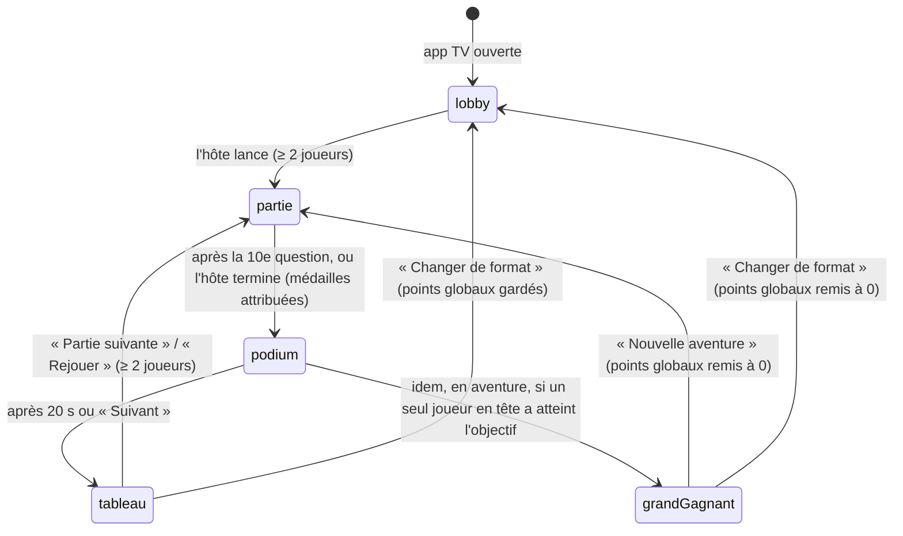
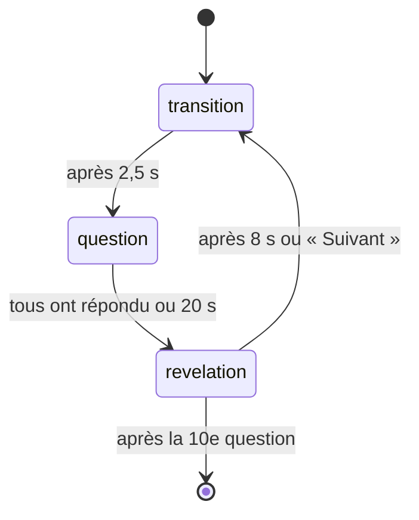

# Quiz TV — Spec du MVP

## Objectif

Le MVP permet à 2 à 10 amis réunis dans une même pièce de jouer une partie complète de quiz de culture générale. La TV (Mi TV Stick 4K) affiche la partie, et chaque téléphone sert de manette via une simple page web, sans rien installer.

Le MVP est réussi si une soirée réelle se déroule sans intervention technique : ouvrir l'app TV, scanner le QR code, jouer 10 questions, voir le podium, puis rejouer. Il doit aussi supporter au moins une déconnexion de téléphone en cours de partie.

Le code et le modèle de données doivent permettre d'ajouter ensuite d'autres modes de jeu sans tout réécrire. Cinq modes sont prévus après le MVP (voir « Modes de jeu supplémentaires »).

## Déroulé d'une partie

Une salle passe par 5 états communs à tous les modes, pilotés par le serveur : `lobby`, `partie`, `podium`, `tableau` et `grandGagnant`. Pendant une partie, le mode a ses propres phases, dans `etatMode.phase`. La TV et les téléphones ne font qu'afficher l'état reçu.


```mermaid
stateDiagram-v2
    [*] --> lobby: app TV ouverte
    lobby --> partie: l'hôte lance (≥ 2 joueurs)
    partie --> podium: après la 10e question, ou l'hôte termine (médailles attribuées)
    podium --> tableau: après 20 s ou « Suivant »
    podium --> grandGagnant: idem, en aventure, si un seul joueur en tête a atteint l'objectif
    tableau --> partie: « Partie suivante » / « Rejouer » (≥ 2 joueurs)
    tableau --> lobby: « Changer de format » (points globaux gardés)
    grandGagnant --> partie: « Nouvelle aventure » (points globaux remis à 0)
    grandGagnant --> lobby: « Changer de format » (points globaux remis à 0)
```

Phases du quiz pendant la partie :


```mermaid
stateDiagram-v2
    [*] --> transition
    transition --> question: après 2,5 s
    question --> revelation: tous ont répondu ou 20 s
    revelation --> transition: après 8 s ou « Suivant »
    revelation --> [*]: après la 10e question
```

La fermeture après 30 min sans aucune connexion (ni TV ni joueur) peut arriver dans n'importe quel état, pas seulement au podium.

1. **Création de la salle.** À l'ouverture de l'app, la TV demande une salle au serveur. Elle affiche un grand QR code, le code de salle en 4 lettres et la liste des joueurs (vide).
2. **Arrivée des joueurs.** Chaque joueur scanne le QR code (ou tape le code), saisit un pseudo et apparaît sur la TV avec sa couleur. Le premier arrivé devient l'hôte (couronne sur la TV).
3. **Lancement.** En deux étapes (tranche 27). L'hôte choisit d'abord le format (« Petite partie » ou « Aventure », voir « Format et médailles ») et appuie sur « Démarrer ». Il choisit ensuite le mode et ses options (pour le quiz, les thèmes et la difficulté des questions), puis voit un bouton « Lancer la partie », actif dès que le mode a assez de joueurs connectés, et « Changer de format » pour revenir à la première étape.
4. **Question.** La TV annonce d'abord « Question 5/10 » et la catégorie pendant 2,5 s (les téléphones affichent « Regarde la TV »), puis affiche la question, les 4 réponses (couleur + forme), le chrono de 20 s et qui a déjà répondu. Les téléphones affichent 4 gros boutons. Un joueur répond une seule fois, sans changer d'avis.
5. **Révélation.** Dès que tous les joueurs attendus ont répondu (voir « Fin anticipée »), ou à la fin du chrono, la TV montre la bonne réponse, le nombre de réponses par choix, qui a eu juste, la réponse la plus rapide (« ⚡ Léa en 1,8 s »), puis le classement : les scores montent et une flèche ▲▼ montre qui a gagné ou perdu des places. Chaque téléphone affiche « Bonne réponse, +740 », « Raté » ou « Pas de réponse ».
6. **Enchaînement.** Passage automatique après 8 s. L'hôte peut accélérer avec « Suivant ».
7. **Fin.** Après 10 questions, la TV affiche le podium avec les médailles, en révélant le 3e, puis le 2e, puis le 1er, et les téléphones le rang de chacun. En quiz, les prix de la partie remplacent ensuite le classement (voir « Prix de fin de partie »).
8. **Tableau.** Après 20 s (ou « Suivant » de l'hôte), la TV affiche les points globaux. En aventure, si un seul joueur en tête a atteint l'objectif, c'est l'écran du grand gagnant à la place.
9. **Rejouer.** L'hôte appuie sur « Partie suivante » (aventure) ou « Rejouer » (petite partie), actif dès 2 joueurs connectés : mêmes joueurs, scores remis à zéro, points globaux gardés, nouvelles questions jamais vues dans cette salle.

## Fonctionnalités du MVP

### Salle
- Création automatique d'une salle à l'ouverture de l'app TV (code de 4 lettres, QR code vers la page joueur)
- 2 à 10 joueurs connectés, 1 joueur autorisé pour tous les modes en mode développeur (`MODE_DEV=1`)
- Rôle d'hôte pour le premier arrivé, transféré automatiquement après 10 s de déconnexion
- Fermeture automatique après 30 min sans aucune connexion, dans n'importe quel état. Tant que la TV est connectée, la salle reste ouverte.
- Jeton secret remis à la TV à la création de la salle, exigé pour s'y reconnecter

### Joueur
- Rejoindre par QR code ou par saisie du code
- Pseudo unique de 1 à 12 caractères, couleur attribuée automatiquement (voir « Couleurs »)
- Reconnexion automatique avec conservation du pseudo et du score, grâce à une clé secrète remise au seul téléphone
- Écran maintenu allumé pendant la partie (Wake Lock)

### Partie de quiz
- 10 questions tirées au hasard, sans répétition dans la salle, et équilibrées : 4 faciles, 4 moyennes et 2 difficiles, au plus 2 par catégorie. Les questions jamais vues passent avant cet équilibre, qui est assoupli quand la banque est épuisée
- Thèmes et niveaux (Facile, Moyen, Difficile), tous cochés par défaut, que l'hôte décoche en salle d'attente
- QCM à 4 choix, chrono de 20 s, points dégressifs selon la rapidité
- Révélation, classement intermédiaire, podium final avec médailles, tableau des points globaux, « Rejouer »

### TV
- Page TV ouverte dans un navigateur installé sur le stick (l'APK est en réserve, voir « Contraintes techniques »)
- Écran jamais mis en veille : Wake Lock sur la page TV et réglages du stick (tranche 18)
- Reconnexion automatique à sa salle après un rechargement ou une coupure réseau
- En réserve avec l'APK : touche Retour = « Quitter ? », touche OK = recréer une salle

### Contenu
- Fichier JSON d'environ 300 questions en français, en 11 catégories dont `maths-logique`, texte uniquement, relues à la main. Un tiers environ porte sur la culture populaire et l'actualité depuis 2010
- Dictionnaire du Mot le plus long (`data/mots.txt`, tranche 28) : tiré de Lexique 3.83 (B. New et C. Pallier, www.lexique.org), sous licence CC BY-SA 4.0, comme `data/mots.txt` qui en dérive

## Hors périmètre

Ces éléments sont volontairement repoussés. Le modèle de données ne doit pas les empêcher.

- Les modes de jeu autres que ceux déjà en place (Quiz, tranches 11 à 15, 24 à 26, 28 à 30 et 32) : La réplique est prévue à la tranche 23, Menteur à la tranche 31, les autres sont dans « Plus tard »
- Le choix d'un thème ou d'une difficulté dans les autres modes que le quiz
- Les questions avec image, son ou vidéo (sauf les GIF de La légende et les extraits du Blind test)
- Les sons sur les téléphones, et la musique en dehors de la salle d'attente (sauf les extraits joués par la TV au Blind test)
- Le jeu à distance, hors de la pièce de la TV
- Les comptes, l'historique des parties et toute base de données
- Un back-office pour éditer les questions
- Les langues autres que le français
- La survie des parties à un redémarrage du serveur
- Le pilotage de la partie à la télécommande
- Plus de 10 joueurs et les spectateurs

## Règles des modes

### Quiz culture générale (MVP)

- Une partie compte 10 questions (5 ou 15 au choix de l'hôte, voir « Options de l'hôte »). Chaque question est un QCM à 4 choix avec une seule bonne réponse.
- **Thèmes et niveaux**, choisis par l'hôte en salle d'attente : tout est coché par défaut, et l'hôte décoche ce qu'il ne veut pas (au moins un thème et un niveau restent cochés). Les niveaux cochés fixent la répartition des 10 questions : les trois = 4 faciles, 4 moyennes et 2 difficiles ; Facile + Moyen = 6 faciles et 4 moyennes ; Moyen + Difficile = 5 moyennes et 5 difficiles ; Facile + Difficile = 5 faciles et 5 difficiles ; un seul niveau = 10 questions de ce niveau. Au plus 2 questions par catégorie, ou davantage si l'hôte a choisi peu de thèmes (10 divisé par le nombre de thèmes, arrondi au-dessus). Le téléphone de l'hôte affiche le nombre de questions jamais vues pour son choix.
- **Tirage** : d'abord les questions jamais vues du choix de l'hôte, puis ses questions déjà vues (les plus anciennes d'abord). Si le choix compte moins de 10 questions, on complète avec les thèmes choisis toutes difficultés confondues, puis avec toute la banque. Une partie a donc toujours 10 questions.
- Chaque joueur a 20 s pour répondre (10 ou 30 s au choix de l'hôte), en une seule réponse définitive.
- Une mauvaise réponse ou une absence de réponse rapporte 0 point.
- Une bonne réponse rapporte entre 1000 et 500 points selon la rapidité :

  `points = arrondi(1000 - 500 × t / T)`

  Ici, `T` est le temps pour répondre (20 s par défaut) et `t` le temps écoulé en secondes, mesuré par le serveur à la réception de la réponse. On n'utilise jamais l'horloge du téléphone.
- **Fin anticipée** : la manche se termine dès que tous les joueurs attendus ont répondu, ou à 20 s. Les joueurs attendus sont ceux qui étaient connectés au début de la manche et qui le sont encore. Un joueur arrivé en cours de manche n'est pas attendu. Si un joueur attendu se déconnecte, on vérifie à nouveau si tous les autres ont répondu.
- Classement par score total. En cas d'égalité, les joueurs partagent le même rang, sans départage, et le rang suivant est sauté : 1, 1, 3.
- **Transition** : avant chaque question, 2,5 s pour annoncer son numéro et sa catégorie. Le chrono de 20 s et le calcul des points ne partent qu'au début de la question. Aucune réponse n'est acceptée pendant la transition, et les joueurs attendus sont ceux connectés au début de la question.
- **Réponse la plus rapide** : à chaque révélation, la TV nomme la bonne réponse reçue la première, et le téléphone de ce joueur l'indique. À égalité à la milliseconde, la première enregistrée. Aucun point en plus.
- **Prix de fin de partie** : au podium, 4 prix au plus, dans cet ordre, seulement s'ils sont mérités. À égalité, tous les ex æquo le reçoivent. Un joueur qui a quitté la salle n'en reçoit aucun.
  - ⚡ Éclair : la bonne réponse la plus rapide de la partie.
  - 🔥 En série : la plus longue suite de bonnes réponses d'affilée, 3 au moins. Une question non jouée coupe la série.
  - 🦄 Solo : le plus de fois seule bonne réponse d'une question jouée par 3 joueurs ou plus.
  - 🪤 Question piège : la question la plus ratée (une absence de réponse compte comme ratée), si moins de la moitié des joueurs l'ont trouvée.
  - ⏳ Suspense : la bonne réponse la plus tardive, dans le dernier quart du temps pour répondre (après 15 s sur 20), si ce n'est pas aussi celle de l'éclair.
  - 🌙 Dans la lune : le plus de questions sans réponse, 2 au moins.

  Un joueur attendu qui s'est déconnecté sans répondre n'est pas compté dans la question.

### Options de l'hôte (tous les modes, tranche 27)

Dans l'onglet « Options » de la salle d'attente, l'hôte règle pour le mode choisi la longueur de la partie et le temps pour répondre, trois choix chacun. Le choix du milieu est la valeur par défaut, celle d'avant ces options. Les options sont gardées d'une partie à l'autre, comme le format, et résumées sur la TV (« Options : 8 questions · 30 s »). Le serveur mesure toujours le temps.

| Mode | Longueur | Temps pour répondre |
|---|---|---|
| Quiz | 5 / **10** / 15 questions | 10 / **20** / 30 s |
| Estimation | 5 / **8** / 12 questions | 20 / **30** / 45 s |
| Qui de nous ? | 5 / **10** / 15 questions | 10 / **20** / 30 s (vote) |
| Undercover | 1 / **3** / 5 manches | 15 / **20** / 30 s (vote) |
| Même réponse | 5 / **10** / 15 questions | 20 / **30** / 45 s |
| Le bluff | 5 / **8** / 12 questions | 30 / **45** / 60 s (écriture) |
| La légende | 5 / **8** / 12 GIF | 30 / **45** / 60 s (écriture) |
| GéoQuiz | 3 / **5** / 10 manches | 30 / **60** / 90 s |
| Mot le plus long | 5 / **6** / 7 manches | 30 / **45** / 60 s |
| Le compte est bon | 3 / **5** / 7 manches | 45 / **60** / 90 s |
| Petit bac | 3 / **5** / 7 manches, et lettres rares (K, Q, W, X, Y, Z) : **sans** / avec | 60 / **90** / 120 s (sans STOP) |
| Nuancier | 5 / **7** / 10 manches | 15 / **20** / 30 s |
| Blind test | Classique : 1 à 20 chansons (curseur, **10**) ; Mix : chacun maître **1** ou 2 fois | Mix : 90 / **120** / 180 s d'écoute |

Au quiz, la répartition des niveaux et le plafond par catégorie sont mis à l'échelle du nombre de questions (arrondis en dessous, le reste aux niveaux les plus faciles : 15 questions de tous niveaux = 6 faciles, 6 moyennes, 3 difficiles), et le barème des points suit le temps choisi. Au Blind test classique, quand le nombre de chansons ne se partage pas également, les joueurs les plus hauts au classement global sont maîtres une fois de plus.

Les options se règlent en salle d'attente et au tableau, après une partie (onglet « Options » sous les modes). Dans le panneau, une rangée d'options trop large pour l'écran défile vers la droite, sans décaler le reste. Les règles courtes des modes ne citent plus de nombre de questions : il est dans le résumé des options.

### Format et médailles (tous les modes)

- **Format**, choisi par l'hôte en salle d'attente : « Petite partie » (par défaut) ou « Aventure », avec un objectif de 3 à 15 points globaux (5 par défaut).
- **Médailles** à la fin de chaque partie, quel que soit le mode, y compris quand l'hôte la termine avant la fin (sur les scores du moment) : or = 3 points globaux, argent = 2, bronze = 1. Classement « olympique » : les ex æquo partagent la même médaille et le rang suivant est sauté (1, 1, 3 → or, or, bronze ; 1, 2, 2 → or, argent, argent). Un joueur à 0 point dans la partie n'a pas de médaille, même s'il est sur le podium.
- **Points globaux** : ils s'additionnent de partie en partie dans la salle, avec le nombre de médailles de chaque sorte. « Rejouer » et « Changer de format » les gardent. Un joueur qui arrive en cours de route part de 0.
- **Fin d'une aventure** : après les médailles, si un seul joueur a le plus de points globaux et au moins l'objectif, il est le grand gagnant. Si plusieurs joueurs sont à égalité en tête à l'objectif ou au-delà, on joue une partie de plus (« Départage ! » sur le tableau).
- **Nouvelle aventure** (ou « Changer de format » après un grand gagnant) : points globaux, médailles et numéro de partie remis à 0, même objectif.

### Modes de jeu supplémentaires (après le MVP)

Résumés seulement. Les règles détaillées de chaque mode sont écrites dans sa mini-spec (`docs/modes/`), juste avant de le coder. Le maximum reste 10 joueurs pour tous les modes.

| Ordre | Mode | Joueurs | Résumé |
|---|---|---|---|
| 1 | **Estimation** (disponible, voir `docs/modes/estimation.md`) | 3 à 10 | Une question à réponse numérique (« Combien de km entre Casablanca et Paris ? »). Chacun saisit un nombre, le plus proche gagne. |
| 2 | **Qui de nous ?** (disponible, voir `docs/modes/qui-de-nous.md`) | 4 à 10 | « Qui est le plus susceptible de rater son avion ? ». Chacun vote pour un joueur, la TV affiche les résultats. |
| 3 | **Undercover** (disponible, voir `docs/modes/undercover.md`) | 4 à 10 | Chacun reçoit un mot secret sur son téléphone : les undercovers ont un mot légèrement différent, Mister White (dès 5 joueurs) n'en a aucun. Tours de description à voix haute, puis vote pour éliminer les intrus. Mister White éliminé peut gagner en devinant le mot des civils. |
| 4 | **Même réponse** (disponible, voir `docs/modes/meme-reponse.md`) | 3 à 10 | « Cite un fruit rouge ». On marque des points si on donne la même réponse que d'autres joueurs. |
| 5 | **Le bluff** (disponible, voir `docs/modes/bluff.md`) | 4 à 10 | Question obscure : chacun invente une fausse réponse, puis tout le monde cherche la vraie parmi les bluffs. Points pour avoir trouvé et pour avoir piégé. |
| 6 | **La légende** (disponible, voir `docs/modes/legende.md`) | 3 à 10 | La TV joue un GIF en boucle, chacun lui invente un titre, puis tout le monde vote pour son préféré (jamais le sien). 500 points par vote reçu, bonus « Légendaire ! » à l'unanimité. |
| 7 | **Blind test** (disponible, voir `docs/modes/blind-test.md`) | 3 à 10 | La TV joue des extraits Deezer, les joueurs crient le titre et l'artiste. Chacun son tour maître du jeu : il voit la réponse sur son téléphone et désigne qui a trouvé. Deux formats choisis par l'hôte : Classique (une chanson par manche, 500 points le titre, 500 l'artiste) et Mix (5 chansons en même temps, retirées dès qu'elles sont trouvées, 1000 points les deux, 500 l'un des deux). |
| 8 | **GéoQuiz** (disponible, voir `docs/modes/geoquiz.md`) | 2 à 10 | Inspiré de GeoGuessr : la TV montre la photo d'un lieu réel, chacun pose un pin sur une carte du monde sur son téléphone. Distance calculée par le serveur, `arrondi(5000 × e^(−km / 2000))` points. 3, 5 ou 10 manches, du plus facile au plus difficile. |
| 9 | **Mot le plus long** (disponible, voir `docs/modes/mot-le-plus-long.md`) | 2 à 10 | 9 lettres tirées (au moins 2 voyelles et 2 consonnes), 45 secondes pour former en secret, en touchant les tuiles, le mot le plus long. Le mot valide le plus long marque autant de points que de lettres (ex æquo : tous marquent). Mot absent du dictionnaire : 0. La TV montre à la fin le plus long mot possible. |
| 10 | **Le compte est bon** (disponible, voir `docs/modes/le-compte-est-bon.md`) | 2 à 10 | 6 plaques (1 à 10 en double, 25, 50, 75, 100) et une cible de 101 à 999, toujours atteignable. 60 secondes pour construire son calcul pas à pas sur le téléphone, jusqu'à 3 propositions (la plus proche est gardée). Compte exact : 10 points, sinon le plus proche, au-dessus ou au-dessous : 5 (ex æquo : tous marquent). La TV montre à la fin une solution la plus courte, trouvée par le serveur. |
| 11 | **Petit bac** (disponible, voir `docs/modes/petit-bac.md`) | 2 à 10 | Une lettre et 6 catégories tirées au hasard. Le premier dont les 6 cases commencent par la lettre appuie sur STOP : les autres ont 10 secondes (90 s au plus sans STOP). La TV montre les réponses catégorie par catégorie, acceptées par défaut sauf celles qui ne commencent pas par la lettre ; l'hôte refuse ou réaccepte après le débat. 1 point par réponse acceptée, réponses identiques comprises. 3, 5 ou 7 manches, une nouvelle lettre à chacune. |
| 12 | **Menteur** (Perudo, tranche 31) | 2 à 10 | 5 dés cachés par joueur, visibles sur son seul téléphone. Enchères « au moins N dés montrent V » sur tous les dés en jeu, les 1 (pacos) sont jokers. « Menteur ! » révèle les dés sur la TV : le perdant du défi perd un dé. Le premier joueur sans dé perd. |
| 13 | **Nuancier** (disponible, voir `docs/modes/nuancier.md`) | 2 à 10 | La TV montre le logo d'une marque connue dont une zone de couleur a été retirée. Chacun recrée la couleur sur son téléphone avec deux curseurs (teinte et luminosité, saturation de la cible). Ressemblance = `max(0, arrondi(100 − ΔE × 1,5))` %, ΔE CIE76 dans l'espace Lab, points = ressemblance × 10. 5, 7 ou 10 manches. |

## Cas limites

| Situation | Comportement |
|---|---|
| Joueur déconnecté pendant une partie | Grisé sur la TV, garde son score et son pseudo (réservé), ne bloque pas la manche. Jamais supprimé pendant une partie. |
| Joueur déconnecté en salle d'attente | S'il n'a encore ni point global ni médaille : retiré de la salle après 10 s de déconnexion. Sinon (par exemple après « Changer de format ») : jamais retiré, grisé, il garde ses points globaux et ses médailles, comme au tableau. |
| Joueur déconnecté au podium, au tableau ou au grand gagnant | Comme pendant une partie : jamais retiré, garde ses points globaux et ses médailles. |
| Joueur qui revient | Retrouve pseudo et score grâce à son identifiant et sa clé mémorisés, et reprend à l'écran en cours. |
| Reconnexion avec l'identifiant d'un autre joueur, sans sa clé | Refusée : traitée comme une nouvelle arrivée (« Pseudo déjà pris » ou pseudo invalide). Le vrai joueur garde sa place, sa connexion et son rôle d'hôte. |
| Joueur retiré de la salle d'attente qui revient | Réinscrit automatiquement avec son pseudo mémorisé, comme un nouveau joueur. Si ce pseudo a été pris entre-temps, il revient au formulaire avec « Pseudo déjà pris ». |
| Hôte déconnecté plus de 10 s | Dans tous les états, le rôle passe au joueur connecté arrivé le plus tôt (`arriveeA`). Si aucun autre joueur n'est connecté, l'hôte ne change pas, et le rôle passe au premier joueur qui se connecte ensuite. L'ancien hôte ne récupère pas le rôle à son retour. En salle d'attente, l'hôte seul est retiré comme les autres, et le prochain joueur qui arrive devient l'hôte. |
| Arrivée en cours de partie | Acceptée avec 0 point, joue à partir de la question suivante. Le QR code reste visible dans un coin. Il en va de même pour un joueur déconnecté au début d'une manche qui revient pendant celle-ci. |
| Reconnexion alors que 10 joueurs sont connectés | Toujours acceptée : un joueur ne perd jamais sa place. |
| Plus de couleur libre (11e joueur pendant qu'un autre est déconnecté) | Le nouveau joueur reprend la couleur d'un joueur déconnecté. |
| Pseudo déjà pris | Message « Pseudo déjà pris », saisie à refaire. Les espaces de début et de fin sont retirés, et la comparaison ignore la casse (« paul » = « Paul »). |
| 11e joueur | Message « Salle pleine (10 max) ». Seuls les joueurs connectés comptent. |
| Code de salle inconnu ou salle fermée | Message « Salle introuvable ». |
| Moins de 2 joueurs connectés en cours de partie | La partie continue. |
| TV rechargée ou coupée | La TV se reconnecte à sa salle et reprend l'état en cours. |
| Serveur redémarré | Partie perdue. La TV recrée une salle et les joueurs voient « Salle introuvable ». |
| Plus assez de questions inédites | On réautorise les questions déjà vues, en commençant par les plus anciennes. Avec un choix de thèmes et de niveaux, on reste dans ce choix tant qu'il compte 10 questions (voir « Tirage »). |

## Format des données

Toutes les salles vivent en mémoire sur le serveur, dans un objet `salles` indexé par code. Le champ `mode` et le bloc `etatMode` isolent ce qui est propre au quiz : un nouveau mode ajoute son propre `etatMode` sans toucher au reste. Le serveur passe par un registre des modes (`server/modes/index.js`), et chaque mode respecte le même contrat (voir `docs/modes/estimation.md`).

### Question (fichier `questions.json`)

```json
{
  "id": "q0042",
  "texte": "Quelle est la capitale de l'Australie ?",
  "reponses": ["Sydney", "Canberra", "Melbourne", "Perth"],
  "bonneReponse": 1,
  "categorie": "geographie",
  "difficulte": 2
}
```

`bonneReponse` est l'index de la bonne réponse (de 0 à 3). L'ordre d'affichage est mélangé à chaque tirage, et `bonneReponse` est alors recalculé pour pointer vers la même réponse. Un test automatique vérifie ce recalcul. La `difficulte` va de 1 (facile) à 3 (difficile). La `categorie` est l'une des 11 du script de vérification : `geographie`, `histoire`, `sciences`, `nature`, `art-litterature`, `cinema-tv`, `musique`, `sport`, `gastronomie`, `langue-divers`, `maths-logique`. Chacune a un libellé, annoncé par l'écran de transition (« Maths et logique »).

### Joueur

```json
{
  "id": "j_8f3k2a",
  "cle": "c_4e1a9b...",
  "pseudo": "Paul",
  "couleur": 1,
  "score": 2740,
  "pointsGlobaux": 7,
  "medailles": { "or": 2, "argent": 0, "bronze": 1 },
  "connecte": true,
  "socketId": "aXc91...",
  "arriveeA": 1758641000000
}
```

`score` est celui de la partie en cours, remis à 0 à chaque lancement. `pointsGlobaux` et `medailles` s'accumulent de partie en partie (voir « Format et médailles »). `id` est généré par le serveur et mémorisé dans le navigateur du téléphone. Il est public : les listes de candidats de Qui de nous ? et d'Undercover l'envoient à tous les téléphones. `cle` est un secret aléatoire (16 octets) généré avec lui, remis au seul téléphone du joueur (dans son `joueur:etat`) et mémorisé à côté de l'`id` : la reconnexion exige les deux. La TV et les autres joueurs ne reçoivent jamais la clé. `couleur` est un numéro de 1 à 10 : la teinte réelle est définie dans le CSS (`--joueur-1` à `--joueur-10`, voir « Couleurs »). `socketId` change à chaque reconnexion. `arriveeA` sert à choisir le prochain hôte.

### Salle

```json
{
  "code": "KDZP",
  "mode": "quiz",
  "etat": "partie",
  "hoteId": "j_8f3k2a",
  "tvSocketId": "Zp0e4...",
  "jetonTv": "t_91kd02mz4q...",
  "joueurs": ["...objets Joueur..."],
  "questionsVues": ["q0042", "q0107"],
  "derniereActiviteA": 1758641200000,
  "format": { "type": "aventure", "objectif": 5 },
  "formatValide": true,
  "numeroPartie": 3,
  "grandGagnantId": null,
  "debutPodiumA": 1758641100000,
  "medaillesPartie": { "j_8f3k2a": "or" },
  "reglagesMode": { "quiz": { "categories": ["cinema-tv"], "niveaux": [1, 2], "longueur": 10, "temps": 20 } },
  "etatMode": {
    "phase": "question",
    "questions": ["...10 questions tirées..."],
    "indexQuestion": 3,
    "debutPhaseA": 1758641190000,
    "debutQuestionA": 1758641190000,
    "attendus": ["j_8f3k2a", "j_2m9x7c"],
    "reponses": { "j_8f3k2a": { "choix": 1, "recuA": 1758641195300 } }
  }
}
```

`etat` vaut `lobby`, `partie`, `podium`, `tableau` ou `grandGagnant`. Pendant une partie, `etatMode.phase` vaut `transition`, `question` ou `revelation` pour le quiz. `etatMode.attendus` liste les `id` des joueurs attendus pour la manche en cours (voir « Fin anticipée ») : tous les modes l'utilisent, via `server/modes/commun.js`. Les timers (2,5 s de transition, 20 s, 8 s, 20 s de podium, 10 s pour l'hôte et pour le retrait d'un joueur en salle d'attente) sont gérés par le serveur. Dans tous les modes, `debutPhaseA` est l'heure de début de la phase en cours, d'où part son chrono ; le quiz garde en plus `debutQuestionA`, qui sert à mesurer le temps de chaque réponse (points, réponse la plus rapide, prix).

`format.type` vaut `petite` ou `aventure`, et `format.objectif` va de 3 à 15. `formatValide` dit à quelle étape de la salle d'attente en est l'hôte : `false` pour le choix du format (à la création et après « Changer de format »), `true` pour le choix du mode (après « Démarrer »), et il le reste pendant la partie et au tableau. `numeroPartie` compte les parties lancées depuis la création de la salle ou la dernière nouvelle aventure. `medaillesPartie` donne la médaille (`or`, `argent`, `bronze`) de chaque joueur médaillé de la dernière partie. `grandGagnantId` n'est rempli qu'à l'état `grandGagnant`. Ces champs sont communs à tous les modes : le code commun (`server/salles.js`, `server/medailles.js`) les gère sans jamais lire `etatMode`.

`reglagesMode` range les réglages choisis par l'hôte pour chaque mode, par id de mode : thèmes et niveaux du quiz, format du Blind test (`{ "blind-test": { "format": "mix" } }`). Le mode les valide et les lit, le code commun les range sans les lire. Ils sont gardés d'une partie à l'autre, comme le format.

`jetonTv` est un secret aléatoire généré à la création de la salle et envoyé uniquement à la TV. Il empêche un joueur de se faire passer pour la TV avec le seul code de salle, puis de lire les bonnes réponses et les `id` des joueurs.

### Événements Socket.IO

Règle simple : les clients envoient des actions, le serveur répond en diffusant l'état complet de la salle. Pas de synchronisation fine, et la reconnexion devient triviale.

| Événement | Sens | Contenu |
|---|---|---|
| `tv:creer` | TV → serveur | code et `jetonTv` de l'ancienne salle, facultatifs, pour s'y reconnecter. Sans jeton valide, une nouvelle salle est créée. |
| `joueur:rejoindre` | téléphone → serveur | code, pseudo, id et clé mémorisés éventuels. Sans la clé de cet id, pas de reconnexion : c'est une nouvelle arrivée. |
| `hote:validerFormat` | téléphone de l'hôte → serveur | rien. « Démarrer » : accepté en salle d'attente, au choix du format. Passe au choix du mode (`formatValide`). |
| `hote:lancer` | téléphone de l'hôte → serveur | rien. Accepté en salle d'attente, une fois le format validé, avec assez de joueurs pour le mode choisi. |
| `joueur:repondre` | téléphone → serveur | la réponse, interprétée par le mode : index du choix (Quiz, vote du bluff), nombre entier (Estimation), texte (Même réponse, bluff en saisie, devinette de Mister White), `id` d'un joueur (Qui de nous ?, vote d'Undercover), `{ lancer: true }` et `{ passer: true }` du maître du Blind test (relais, tranche 27). Le détail et les refus sont dans la mini-spec de chaque mode. |
| `hote:suivant` | téléphone de l'hôte → serveur | `{ etape }` : l'étape affichée par le téléphone (reçue dans `joueur:etat`). Si ce n'est plus l'étape en cours (double appui, chrono écoulé entre-temps), l'action est ignorée. Pendant une partie, le « Suivant » du mode. Au podium, passe au tableau (ou au grand gagnant). |
| `hote:rejouer` | téléphone de l'hôte → serveur | rien. Accepté au tableau et au grand gagnant. Relance le mode choisi ; depuis le grand gagnant, remet d'abord les points globaux à 0 (« Nouvelle aventure »). |
| `hote:configurer` | téléphone de l'hôte → serveur | `{ type: "petite" \| "aventure", objectif }`. Accepté seulement en salle d'attente, avec un objectif entier de 3 à 15. |
| `hote:reglerMode` | téléphone de l'hôte → serveur | `{ categories, niveaux }` pour le quiz : une liste non vide de catégories connues, et une liste non vide de niveaux (1, 2, 3 : les difficultés des questions). `{ format, chansons, tours, ecoute }` pour le Blind test (voir `docs/modes/blind-test.md`). `{ longueur, temps }` pour les autres modes, et en plus pour le quiz (voir « Options de l'hôte »). Toujours le réglage complet : le téléphone renvoie les valeurs reçues avec le seul changement. Accepté en salle d'attente et au tableau (après une partie, comme le choix du mode). |
| `hote:changerFormat` | téléphone de l'hôte → serveur | rien. Accepté au tableau, au grand gagnant et en salle d'attente au choix du mode : retour en salle d'attente, au choix du format. |
| `hote:choisirMode` | téléphone de l'hôte → serveur | `id` du mode. Accepté seulement en salle d'attente ou au tableau, pour un mode jouable avec assez de joueurs connectés (voir `docs/modes/estimation.md`). |
| `hote:terminer` | téléphone de l'hôte → serveur | rien. Arrête la partie en cours et passe au podium. |
| `salle:etat` | serveur → TV | état complet de la salle, avec le texte des questions et le `jetonTv`. `bonneReponse` n'y figure qu'à partir de la révélation. Hors partie, aussi `tableau` (joueurs triés par points globaux, avec rang, médailles et `ecartAuLeader`), `departage`, `pointsMedaille` et `reglages` (voir `joueur:etat`). Jamais la `cle` d'un joueur. |
| `joueur:etat` | serveur → un téléphone | vue personnalisée : mode, écran à afficher, a déjà répondu, résultat, rang, est hôte, `peutTerminer` (hôte pendant une partie), `etape` (la même chaîne que l'étape repérée par la TV, `etat:phase:numero`, à renvoyer avec `hote:suivant`). Toujours sa propre `cle`. Hors partie, aussi `format`, `formatValide`, `pointsGlobaux` et `reglages` (pour le quiz : thèmes et niveaux choisis, leur résumé « Cinéma et TV · Facile », le nombre de questions jamais vues pour ce choix et les options proposées ; `null` pour un mode sans réglages) ; au podium `medaille` et `gain` ; au tableau et au grand gagnant `rangGlobal`, `numeroPartie`, `grandGagnant` et `estGrandGagnant`. |
| `erreur` | serveur → client | code + message (pseudo pris, salle pleine, salle introuvable) |

Ni le téléphone ni la TV ne reçoivent la bonne réponse avant la révélation, pour éviter la triche via les outils du navigateur.

## Écrans à concevoir

Principe : l'information est sur la TV, le téléphone ne montre que ce qu'il faut pour agir. La TV doit rester lisible à 3 mètres (texte de 40 px minimum en 1080p). Les écrans du téléphone doivent s'utiliser d'une main.

### TV (1920×1080)

| Écran | Contenu |
|---|---|
| Connexion | « Connexion au serveur… » en plein écran tant que la page n'a jamais été connectée, puis en bandeau lors d'une coupure, avec nouvelle tentative automatique (tranche 18, voir Contraintes techniques) |
| Salle d'attente | QR code géant, code en 4 lettres, URL courte, joueurs arrivés (couleur, pseudo, couronne de l'hôte), mode choisi et sa règle courte (« N joueurs minimum » s'il en manque ; « L'hôte choisit le format » tant que le format n'est pas validé), format (« Petite partie » ou « Aventure — 5 points pour gagner »), en quiz « Questions : Cinéma et TV · Facile », « En attente que l'hôte lance ». 10 joueurs tiennent dans l'écran |
| Question | Numéro (3/10), texte, 4 réponses (couleur + forme ▲ ◆ ● ■), chrono, pastilles des joueurs ayant répondu, petit QR code dans un coin |
| Révélation | Bonne réponse mise en avant, nombre de réponses par choix, qui a eu juste, puis classement avec les points gagnés |
| Podium | Tous les joueurs de rang 3 ou mieux (ex æquo possibles, donc parfois plus de 3) avec leur médaille, classement complet dessous avec « 🥇 +3 / 🥈 +2 / 🥉 +1 », « Points globaux dans un instant » |
| Tableau | Joueurs triés par points globaux (rang, pseudo, médailles obtenues 🥇🥈🥉, points), « Après la partie N ». En aventure : l'objectif, l'écart au leader et « Départage ! » en cas d'égalité en tête à l'objectif. « Prochain mode : … », « L'hôte peut relancer » |
| Grand gagnant | Nom du grand gagnant en grand, classement final de l'aventure, « L'hôte peut lancer une nouvelle aventure » |
| Quitter ? | Boîte de confirmation déclenchée par la touche Retour (en réserve avec l'APK, tranche 9) |

### Téléphone (portrait)

| Écran | Contenu |
|---|---|
| Rejoindre | Code pré-rempli depuis le QR code, champ pseudo, bouton « Entrer », messages d'erreur |
| Attente | « Tu es dans la salle », sa couleur. Pour l'hôte, deux étapes (tranche 27) : d'abord seulement « Petite partie » / « Aventure » (et en aventure le réglage − / + de l'objectif) et « Démarrer » ; ensuite le format en rappel, un bouton par mode (grisé s'il manque des joueurs ; « Bientôt » pour un mode annoncé mais pas encore codé, listé dans `modesAVenir` du registre des modes, vide aujourd'hui : l'affichage « Bientôt » est gardé pour les prochains modes), dessous l'onglet « Options » : le résumé des réglages du mode choisi avec « Changer » (en quiz « Questions : Tous les thèmes · Tous niveaux », qui ouvre le choix des thèmes et des niveaux, à cocher ou décocher, avec le nombre de questions jamais vues), ou « Pas d'option pour ce mode », puis « Lancer la partie » (inactif sous le minimum du mode choisi) et « Changer de format ». Pour les autres : le format, puis, une fois le format validé, « Mode : … » et en quiz les questions choisies |
| Répondre | 4 gros boutons couleur + forme, sans texte, qui occupent tout l'écran |
| Réponse envoyée | « Réponse envoyée, regarde la TV » avec le bouton choisi |
| Résultat | « Bonne réponse, +740 », « Raté » ou « Pas de réponse », rang actuel. Le bouton touché est marqué dès l'appui, avant la réponse du serveur. Pour l'hôte : bouton « Suivant » |
| Fin | Rang final, score, médaille et points globaux gagnés (« 🥇 Médaille d'or, +3 » ou « Pas de médaille cette fois »). Pour l'hôte : « Suivant » |
| Tableau | Rang et points globaux. Pour l'hôte : les boutons de mode, l'onglet « Options » du mode choisi (tranche 27), « Partie suivante » (aventure) ou « Rejouer » (petite partie), inactif sous le minimum du mode choisi, et « Changer de format ». Pour les autres : « Mode : … » |
| Grand gagnant | « Tu gagnes l'aventure ! » ou « X gagne l'aventure », rang et points globaux. Pour l'hôte : « Nouvelle aventure » et « Changer de format » |
| En attente de la prochaine question | Pour un joueur arrivé en cours de manche |
| Reconnexion | Bandeau « Reconnexion… » quand la connexion saute |

### Couleurs

Ambiance « Pop et coloré » (choisie à la tranche 7) : fond crème à pois, gros contours foncés, relief par une bordure basse épaisse, police Fredoka hébergée dans le dépôt. Toutes les couleurs sont des variables dans `public/commun/theme.css` : changer d'ambiance revient à modifier ce seul fichier. Les réponses ne sont jamais identifiées par la couleur seule : la forme (dessinée en SVG) les distingue toujours.

Fond `#FFF1CC`, texte et contours `#1B1035`, accent `#FF4F8B`.

Réponses :

| Forme | Couleur |
|---|---|
| ▲ | Rouge `#F2353F` |
| ◆ | Bleu `#2F6BFF` |
| ● | Jaune `#FFC01F` (forme et texte foncés) |
| ■ | Vert `#17A34A` |

Joueurs, attribués dans cet ordre (première couleur libre). Le serveur n'envoie que le numéro. Sur la TV, une pastille qui n'a pas le pseudo à côté porte l'initiale du joueur (blanche ou foncée selon la couleur, `--texte-joueur-N`) : les joueurs restent distinguables pour un daltonien. Un joueur déconnecté est à 60 % d'opacité, avec une icône pause.

| # | Couleur |
|---|---|
| 1 | Orange `#FF7A00` |
| 2 | Rose `#FF4FA0` |
| 3 | Violet `#8A4DFF` |
| 4 | Cyan `#00B4C6` |
| 5 | Menthe `#19C37D` |
| 6 | Citron vert `#8BC000` |
| 7 | Brun `#9A5B34` |
| 8 | Bleu marine `#2B3A8F` |
| 9 | Bleu ciel `#3E9BFF` |
| 10 | Canard `#117777` |

## Contraintes techniques

### Mi TV Stick 4K

- Android TV 11 et 2 Go de RAM : la page TV reste en HTML/CSS/JS sans framework, avec des animations CSS simples (opacité, déplacement) et aucune image lourde. Exceptions : les vidéos MP4 de La légende (tranche 24), une seule jouée à la fois, 1 Mo au plus chacune ; les extraits Deezer du Blind test (tranche 25), jusqu'à 5 `<audio>` joués en même temps (MP3 de 30 s, environ 480 Ko) ; les photos du GéoQuiz (tranche 26), une à la fois, chargées depuis Wikimedia Commons (1920 px, environ 300 à 600 Ko), la suivante préchargée pendant la révélation, et sa carte Leaflet (bibliothèque chargée depuis cdnjs, tuiles CARTO).
- **Pour l'instant, la TV tourne dans un navigateur installé sur le stick**, qui ouvre la page `/tv` du serveur. Cela suffit pour jouer : l'APK est en réserve (tranche 9) et ne sera repris que si la soirée test révèle un problème.
- Réglages du stick avant une soirée : économiseur d'écran et mise en veille réglés sur le délai le plus long. La page TV demande en plus un Wake Lock quand le navigateur le permet (tranche 18).
- Dans le navigateur, le son reste bloqué jusqu'au premier geste : la touche OK de la télécommande le débloque (voir `docs/sons.md`).

### APK (en réserve)

- L'APK est une coquille minimale en Kotlin :
  - une activité plein écran avec une WebView qui charge l'URL de la page TV, sans code métier ;
  - l'écran reste allumé (`FLAG_KEEP_SCREEN_ON`) ;
  - l'app est déclarée pour Android TV (catégorie Leanback + bannière), sinon elle n'apparaît pas sur l'accueil du stick ;
  - les touches Retour et OK sont transmises à la page ;
  - la WebView joue le son sans geste (`mediaPlaybackRequiresUserGesture = false`).
- Toute modification d'affichage se fait côté serveur. On ne réinstalle l'APK que si la coquille change.
- Mettre à jour « Android System WebView » via le Play Store du stick avant les tests.
- Installation de l'APK : on active les options développeur et les sources inconnues, puis on transfère l'APK via l'app « Send Files to TV » ou via ADB en Wi-Fi. C'est détaillé dans la tranche 9.

### Hébergement : Render gratuit pour commencer

Décision : offre gratuite de Render pour le développement et les premières soirées. On passera à une offre payante si les limites gênent. Il n'y a rien à réécrire pour migrer : c'est un simple serveur Node.

Limites connues (doc Render) :

- Mise en veille après 15 min sans requête HTTP ni message WebSocket entrant, puis environ 1 min de réveil. Le premier lancement de la soirée attend donc ~1 min.
  - Parade : ouvrir la page TV quelques minutes avant l'arrivée des invités. Tant que le serveur ne répond pas, c'est le navigateur qui attend. Une fois la page chargée, elle affiche « Connexion au serveur… » tant que le socket n'est pas connecté (tranche 18). La page locale « Réveil du serveur… » de l'APK est en réserve avec lui.
  - Pendant une partie, les échanges Socket.IO (ping/pong toutes les 10 s) empêchent la mise en veille : vérifié à la tranche 18 (H3), salle d'attente ouverte 20 min sans action, sans redémarrage du serveur. Si le serveur venait à s'endormir, la TV interrogerait `/sante` toutes les 5 min.
- Redémarrages possibles à tout moment, et fichiers locaux effacés : cohérent avec le choix « tout en mémoire, partie perdue si redémarrage ». `questions.json` est versionné dans le dépôt, donc il n'est pas concerné.
- 750 h gratuites par mois : suffisant pour un seul service.

### Réseau et navigateurs

- HTTPS obligatoire en production : l'API Wake Lock ne fonctionne qu'en HTTPS. En développement local (http sur le Wi-Fi), elle est simplement ignorée.
- Page joueur testée sur Chrome Android et Safari iOS récents.
- Socket.IO gère les reconnexions. L'identité du joueur repose sur son `id` mémorisé dans le `localStorage`, pas sur le socket.
- Une coupure réelle (4G perdue, écran verrouillé) est détectée par le serveur en 20 s au plus (`pingInterval` et `pingTimeout` de Socket.IO à 10 s). Le délai de 10 s ne démarre qu'après cette détection.
- La TV mémorise son code et son `jetonTv` dans le `sessionStorage` : un rechargement ou une coupure retrouve la salle, un nouvel onglet ou l'app relancée en crée une nouvelle.
- Tests à plusieurs onglets : avec le paramètre `?dev` dans l'URL de la page joueur, l'`id` est mémorisé dans le `sessionStorage` au lieu du `localStorage`. Chaque onglet devient ainsi un joueur distinct.

### Configuration

| Variable d'environnement | Rôle | Par défaut |
|---|---|---|
| `URL_PUBLIQUE` | Adresse de base encodée dans le QR code et affichée sous celui-ci | L'IP locale du PC sur le Wi-Fi (par exemple `http://192.168.1.20:3000`), pour que les téléphones puissent l'ouvrir |
| `MODE_DEV` | `1` autorise une partie à 1 joueur dans tous les modes (lancer, rejouer, choisir le mode) | Désactivé |
| `CLE_CARTO` | Clé des fonds de carte CARTO du GéoQuiz (gratuite, carto.com/basemaps/apikey). Variable et non constante : le dépôt est public | Vide : les tuiles portent « API KEY REQUIRED » |

Dépendance validée pour le QR code : `qrcode`.

## Tranches de développement

Chaque tranche se termine par un test concret. Les numéros des tranches ne changent jamais, même quand l'ordre change.

- **Terminées**, dans l'ordre de réalisation : 1, 2, 3, 4, 5, **8**, 6, 7, **11, 12, 13** (modes de jeu), **16** (sons), **14** (mode de jeu), **17** (médailles et aventure), **15** (mode de jeu), **18** (fiabilité), **19** (lisibilité), **20** (jouabilité), **21** (mise en scène), **22** (contenu et choix des questions), **23** temps 1 (nettoyage), **24** (La légende), **26** (GéoQuiz).
- **En cours** : **27** (retours du test sur la vraie TV).
- **À venir**, après l'audit (`AUDIT.md`) : **10**, puis **23** temps 2 (La réplique). Les identifiants entre parenthèses (R1, TV2…) renvoient à l'audit.
- **En réserve** : la tranche 9 (APK).

Le PC de développement est sur un réseau d'entreprise : les téléphones ne peuvent pas joindre un serveur local. Le déploiement sur Render (tranche 8) est donc passé avant la tranche 6, et les tests sur vrais téléphones se font toujours sur le serveur en ligne. Pendant le développement, la TV est un onglet de navigateur du PC en 1920×1080 ; en soirée, c'est le navigateur du stick.

### MVP (tranches 1 à 8)

- **1. Squelette.** ✅ Terminée. Serveur Node + Express + Socket.IO, pages `/tv` et `/joueur` vides, route `/sante`.
  *Test : un message tapé dans l'onglet joueur s'affiche dans l'onglet TV.*
- **2. Salle d'attente.** ✅ Terminée. Création de salle (code de 4 lettres + QR code), rejoindre avec un pseudo, liste des joueurs en direct, hôte = premier arrivé, erreurs (pseudo pris, salle pleine, salle introuvable).
  *Test : 3 onglets joueurs (avec `?dev`) apparaissent sur la TV, et un 2e « Paul » (ou « paul ») est refusé.*
- **3. Boucle de quiz minimale.** ✅ Terminée. L'hôte lance, 3 questions écrites en dur, les joueurs répondent, révélation, « Suivant » manuel, fin. Mode développeur à 1 joueur (`MODE_DEV=1`).
  *Test : partie complète seul, en 2 onglets.*
- **4. Règles complètes.** ✅ Terminée. Chrono 20 s côté serveur, fin anticipée, points dégressifs, enchaînement automatique après 8 s, classement avec ex æquo, podium, « Rejouer ».
  *Test : les scores correspondent à la formule, et une égalité donne le même rang.*
- **5. Banque de questions.** ✅ Terminée. `questions.json` d'environ 200 questions (générées avec Claude, relues par Paul), tirage sans répétition dans la salle, mélange de l'ordre des réponses (avec test automatique du recalcul de `bonneReponse`), script qui vérifie le format du fichier.
  *Test : 3 parties d'affilée sans aucune question répétée.*
- **8. Déploiement Render** (réalisée juste après la tranche 5) ✅ Terminée. Dépôt GitHub, service gratuit, HTTPS, vérification de la mise en veille pendant une salle d'attente longue. La vérification de la mise en veille a été faite à la tranche 18 (H3).
  *Test : jouer avec un téléphone en 4G.*
- **6. Robustesse.** ✅ Terminée. Reconnexion des joueurs, transfert de l'hôte après 10 s, arrivée en cours de partie, reconnexion de la TV, fermeture des salles après 30 min.
  - Boutons de test sur la page joueur, visibles seulement avec `?dev` : « Couper la connexion 5 s » et « Couper 15 s ». Ils coupent le socket puis le rétablissent après ce délai, ce qui simule une coupure sans avoir à verrouiller un téléphone. 5 s reste sous le seuil de 10 s (l'hôte et le joueur en salle d'attente sont conservés), 15 s le dépasse.
  - Tests automatiques de scénarios avec le temps simulé (`mock.timers` de `node:test`), sans attendre les vrais délais : reconnexion d'un joueur avec conservation du pseudo et du score, retrait d'un joueur déconnecté en salle d'attente après 10 s, transfert de l'hôte après 10 s (et pas avant), pas de transfert si aucun autre joueur n'est connecté, fermeture d'une salle après 30 min sans connexion.
  *Test : sur Render, avec de vrais téléphones en 4G et des onglets `?dev` sur le PC : couper un joueur 5 s puis 15 s, couper l'hôte plus de 10 s, recharger la TV.*
- **7. Habillage.** ✅ Terminée. Design TV lisible à 3 mètres, boutons couleur + forme, écrans d'attente et de résultat, Wake Lock.
  - Mise à l'échelle de la page TV : elle reste conçue en 1920×1080, mais elle est réduite ou agrandie en bloc pour tenir entière dans la fenêtre, centrée et sans déformation. Cela évite de zoomer quand le navigateur offre moins de place (écran de PC avec mise à l'échelle Windows à 125 %, WebView du stick qui voit souvent 960×540). Le facteur est calculé en JavaScript (`ajusterEchelle()`), au chargement et à chaque redimensionnement, car le calcul en CSS pur demande des fonctions trop récentes pour la WebView d'Android TV 11.
  - Arrêt de la partie par l'hôte : un bouton « Terminer la partie » sur le téléphone de l'hôte, pendant une question ou une révélation, avec une confirmation pour éviter un appui accidentel. Le téléphone envoie `hote:terminer`, le serveur vérifie que l'émetteur est bien l'hôte et passe directement au podium avec les scores actuels. Une manche en cours n'est pas comptée. « Rejouer » reste disponible ensuite.
  *Test : partie à 4 sur la vraie TV, via l'ordinateur branché. La page TV s'affiche en entier sans zoom du navigateur, quelle que soit la taille de la fenêtre. L'hôte termine une partie à la 4e question : la TV affiche le podium, un autre joueur ne peut pas terminer.*

### Étape « Modes de jeu » (tranches 11 à 15)

Cinq modes ajoutés un par un, dans l'ordre ci-dessous (résumés dans « Modes de jeu supplémentaires »). Chaque mode est testé dans le navigateur via Render : TV dans un onglet du PC, joueurs sur de vrais téléphones et sur des onglets `?dev`.

Règles de l'étape :

- **Une mini-spec par mode**, dans `docs/modes/<mode>.md`, écrite et validée avant de coder le mode. Elle précise au moins : les règles et le calcul des points, les phases de jeu et les chronos, les événements et leur contenu, ce que voient la TV et chaque téléphone (et ce qu'ils ne doivent jamais recevoir), le contenu à préparer (fichier de données et script de vérification), les cas limites (déconnexion, arrivée en cours de partie, joueurs sous le minimum en cours de partie, arrêt par l'hôte) et les tests automatiques.
- **Contraintes du Mi TV Stick** (voir « Contraintes techniques ») : animations CSS simples (opacité, déplacement), pas de flou (`filter: blur`, `backdrop-filter`), pas d'images lourdes.
- Les règles d'architecture restent valables : serveur autoritaire, temps mesuré par le serveur, aucune information secrète envoyée avant la révélation (seule exception : le maître du jeu du Blind test voit la réponse de sa manche), actions `hote:*` vérifiées côté serveur, ce qui est propre à un mode reste dans `etatMode` et `server/modes/<mode>.js`.
- Le quiz reste disponible et continue de marcher à chaque tranche.

Tranches :

- **11. Choix du mode + Estimation.** ✅ Terminée. L'hôte choisit le mode depuis son téléphone, en salle d'attente et à la fin d'une partie. Un mode est grisé tant qu'il n'y a pas assez de joueurs connectés. La TV affiche le mode choisi. Puis le mode Estimation (3 à 10 joueurs).
  *Test : défini dans `docs/modes/estimation.md`.*
- **12. Qui de nous ?** (4 à 10 joueurs) ✅ Terminée.
  *Test : défini dans `docs/modes/qui-de-nous.md`.*
- **13. Undercover** (4 à 10 joueurs) ✅ Terminée.
  *Test : défini dans `docs/modes/undercover.md`.*
- **14. Même réponse** (3 à 10 joueurs) ✅ Terminée.
  *Test : défini dans `docs/modes/meme-reponse.md`.*
- **15. Le bluff** (4 à 10 joueurs) ✅ Terminée.
  *Test : défini dans `docs/modes/bluff.md`.*

### Tranche « Sons » (réalisée après la tranche 13)

- **16. Sons.** ✅ Terminée. Sons synthétisés par le navigateur (Web Audio API, aucun fichier audio) et joués par la TV seulement, musique de fond en salle d'attente, planche de sons `/tv?sons`.
  *Test : défini dans `docs/sons.md`.*

### Tranche « Médailles et aventure » (réalisée après la tranche 14)

- **17. Médailles, points globaux et format « Aventure ».** ✅ Terminée. Choix du format en salle d'attente, médailles de fin de partie (fonction pure `attribuerMedailles` dans `server/medailles.js`, avec tests), points globaux, états `tableau` et `grandGagnant`, passage automatique du podium au tableau après 15 s. Règles dans « Format et médailles ».
  *Test : en local avec 3 onglets `?dev`, une aventure à 3 points jusqu'au grand gagnant, en vérifiant médailles et totaux à chaque tableau ; une égalité en tête (plus simple en Même réponse) donne des médailles partagées ; un joueur coupé pendant le tableau revient avec ses points globaux ; en petite partie, « Rejouer » garde les points globaux et « Changer de format » ramène à la salle d'attente.*

### Priorités après l'audit (tranches 18 à 23)

Ordre : **18 → 19 → 10 → 20 → 21 → 22 → 23**. Les tranches 18 et 19 préparent la soirée test (10). Ses retours peuvent réordonner la suite.

- **18. Fiabilité avant soirée.** ✅ Terminée. Qu'aucun incident technique connu ne puisse gâcher la soirée test, et qu'on puisse comprendre après coup ce qui s'est passé.
  - Plantage du serveur sur un message `null` (R1, T1) : aucune donnée reçue ne fait tomber le process, et une erreur imprévue dans une action est journalisée sans arrêter le serveur.
  - Joueur fantôme (R3, TEL2) : un socket déjà joueur de la salle ne crée pas de 2e joueur, et « Entrer » reste désactivé jusqu'à la réponse du serveur.
  - Double « Suivant » (R2) : un « Suivant » qui ne correspond plus à l'étape affichée est ignoré.
  - Undercover bloqué à 2 participants (R9) : la manche se termine.
  - Tests automatiques TE1 à TE4 et TE7.
  - Journal des événements et des erreurs (H1) : une ligne courte par événement important (salle créée, arrivée, départ, hôte, partie lancée, podium, salle fermée) et chaque erreur complète.
  - `/sante` enrichi (H6) : nombre de salles, nombre de joueurs connectés, heure de démarrage du serveur.
  - Écran et bandeau « Connexion au serveur… » sur la TV (R6, H2) : ils remplacent la page de réveil que devait fournir l'APK.
  - Message clair sur le téléphone après un redémarrage du serveur (R7, H7) : champ code vidé, « Cette partie n'existe plus. Scanne le nouveau QR code sur la TV ».
  - Écran de la TV toujours allumé sans APK : Wake Lock sur la page TV si le navigateur le supporte, et consigne de réglage du stick (voir « Contraintes techniques »).
  - Vérification de la mise en veille de Render sur un lobby de 20 min (H3).
  - Règles dans `CLAUDE.md` : pas de push sur `main` pendant une soirée (H4), `URL_PUBLIQUE` obligatoire sur Render (H5).

  *Test : `npm test` passe avec les nouveaux tests. Sur Render, TV dans le navigateur du stick : (1) depuis la console d'un onglet joueur, `socket.emit('joueur:rejoindre', null)` → les autres joueurs continuent de jouer et l'heure de démarrage de `/sante` n'a pas changé ; (2) double appui très rapide sur « Suivant » à la 10e révélation → le podium reste affiché 15 s ; en Undercover, double appui à l'élimination → le tour de description s'affiche ; (3) double appui sur « Entrer » puis changement de pseudo → la TV ne montre qu'un seul joueur, et la manche suivante se termine dès que tout le monde a répondu ; (4) lobby ouvert 20 min sans action → l'écran de la TV est resté allumé et la partie se lance sans attendre le réveil du serveur ; (5) redéploiement manuel pendant une partie → la TV affiche « Connexion au serveur… » puis une nouvelle salle, les téléphones affichent le message de redémarrage avec un champ code vide, et les logs Render montrent l'enchaînement complet (arrivées, partie, redémarrage).*

- **19. Lisibilité TV et accessibilité.** ✅ Terminée. Chaque texte de la TV se lit depuis le canapé, y compris par un joueur daltonien.
  - Aucun texte de la TV sous 40 px (TV1) : pour tenir 10 joueurs, on réduit le contenu plutôt que la taille (2 colonnes, pseudos tronqués, classement limité avec « et N autres »).
  - Pastilles seules du bluff remplacées par des pastilles avec l'initiale du pseudo, de 40 px au moins (TV2).
  - Joueur déconnecté lisible : moins transparent, avec un signe qui ne dépend pas de la seule transparence (TV3, A4).
  - Couleurs de joueurs 8 et 10 remplacées, initiale dans toute pastille qui n'a pas le pseudo à côté (TV4, A2).
  - Textes neutres au lieu du masculin (TV6).
  - « En attente que l'hôte lance » clignote sans devenir illisible (TV7).

  *Test : TV à 3 m, 10 onglets `?dev` : une partie de bluff et une de Même réponse ; chaque texte est lisible depuis le canapé, y compris les piégés, les joueurs déconnectés et les textes d'Undercover. Dans Chrome DevTools, « Emulate vision deficiencies : deuteranopia » : les 10 joueurs restent distinguables grâce aux initiales. Vérification automatique : aucune règle `font-size` sous 40 px dans `tv.css`, hors planche de sons.*

- **10. Soirée test.** Une vraie soirée avec des amis, en notant les bugs et les frictions. Ces retours décideront si on migre vers une offre payante, si l'on sort l'APK de la réserve, et quels modes améliorer en priorité. La soirée se joue **dans le navigateur du stick, sans APK**.

  *Test : la soirée se déroule sans intervention technique, et on note en plus : la netteté du texte à 3 m (P4) ; l'affichage des émojis de médaille 🥇🥈🥉🏆 (P6) ; l'absence de saccades après 30 min de lobby avec musique (P2) ; si l'écran de la TV s'éteint ou non ; si la touche Retour de la télécommande quitte la page par erreur ; si la touche OK débloque bien le son (bandeau « Cliquez pour activer le son »).*

- **20. Jouabilité.** ✅ Terminée. Le téléphone répond tout de suite, aucun joueur ne perd ses points par accident, et les parties de quiz sont plus régulières.
  - Retours sur le téléphone : bouton marqué dès l'appui (TEL1), « Pas de réponse » au lieu de « Raté » (TEL3), champ d'Estimation vidé à chaque nouvelle question (TEL4), vibration à l'appui et au résultat sur Android (AMB8).
  - Points globaux gardés en salle d'attente (R4) : voir la règle dans « Cas limites ».
  - Tirage équilibré des 10 questions du quiz (F1) : environ 4 faciles, 4 moyennes et 2 difficiles, au plus 2 par catégorie, fonction pure testée.
  - Corrections de contenu (C1) : difficultés de q0160, q0118, q0136 et q0196, formulations de q0054 et q0170.
  - Alerte « paires voisines » dans `scripts/verifier-questions.js` (C3).

  *Test : en 4G, un appui sur une réponse marque le bouton immédiatement (et vibre sur Android). Une question sans réponse affiche « Pas de réponse ». Une Estimation terminée à la 1re question puis relancée montre un champ vide. Après une aventure, « Changer de format », puis verrouillage d'un téléphone 1 min : au déverrouillage, le joueur est toujours là avec ses points globaux. Test automatique : sur 1 000 tirages, jamais plus de 2 questions de la même catégorie ni plus de 2 difficiles. `node scripts/verifier-questions.js` signale les paires voisines connues (par exemple q0081 / q0084, La Joconde).*

- **21. Mise en scène.** ✅ Terminée. Donner à la TV le rythme d'un jeu télévisé et des moments forts à chaque partie.
  - Écran de transition de 2,5 s avec la catégorie avant chaque question, compté dans l'échéance du serveur (AMB1) : phase `transition` du quiz.
  - Podium échelonné, 3e puis 2e puis 1er à 1 s d'écart, fanfare calée sur le 1er, pour tous les modes (AMB2). Le podium dure 20 s.
  - Compteur de score animé au classement, avec flèches ▲▼ de changement de rang (`rangAvant`), pour tous les modes (AMB3).
  - Réponse la plus rapide mise en avant à chaque révélation, sur la TV et le téléphone concerné (MEC7).
  - Prix de fin de partie du quiz, qui remplacent le classement du podium (F4) : règles dans « Prix de fin de partie », fonction pure `calculerPrix` testée.

  *Test : partie de quiz à 4 sur la vraie TV (navigateur du stick) : chaque question est précédée de sa catégorie ; le podium révèle le 3e, le 2e puis le 1er ; les scores montent au classement ; chaque révélation affiche la réponse la plus rapide (« ⚡ Léa en 1,8 s ») ; l'écran de fin montre au moins 3 « prix » justes, vérifiés à la main sur la partie jouée ; aucune saccade visible sur le stick.*

- **22. Contenu et choix des questions.** ✅ Terminée. Plus de questions, plus variées, choisies selon le groupe, et une reconnexion impossible à usurper.
  - 100 questions relues à la main (q0201 à q0300) : 80 récentes et de culture populaire, 20 de la nouvelle catégorie `maths-logique`, soit 300 en tout. `scripts/verifier-questions.js` contrôle en plus les espaces, le « ? » final, la bonne réponse écrite dans la question, les propositions mélangées et le stock de chaque thème par niveau (C2).
  - Choix des thèmes et du niveau (Facile, Normal, Difficile) par l'hôte en salle d'attente, comme le format, affiché sur la TV : événement `hote:reglerMode`, champ `reglagesMode`, règles dans « Quiz culture générale » (F2).
  - Clé secrète de reconnexion (`cle`), remise au seul téléphone, distincte de l'`id` public, jamais envoyée à la TV ni aux autres joueurs (T2).

  *Test : `node scripts/verifier-questions.js` passe. 3 parties d'affilée sans répétition, où les nouvelles questions apparaissent (journal des tirages). En salle d'attente, l'hôte choisit « Cinéma, facile » : 10 questions de cinéma, aucune de difficulté 3. En Qui de nous ?, un onglet qui envoie `joueur:rejoindre` avec l'`id` d'un autre joueur (lu dans la console) est refusé, et ce joueur garde sa place. Test automatique : une reconnexion sans la bonne clé est refusée.*

- **23. Nettoyage puis mode « La réplique ».** Alléger la dette de lisibilité avant d'ajouter un nouveau mode (La légende, tranche 24), puis ajouter un mode de rire qui recycle le bluff. Deux commits distincts.
  - Temps 1 : dette de lisibilité (L1 à L5, L7), sans aucun changement visible, avec tous les tests au vert. ✅ Terminé : aides communes aux modes à questions dans `server/modes/commun.js` (L1), écran « attente de réponses » commun à la TV (L2), bouton de candidat commun au téléphone (L3), `tv/modes/<mode>.css` et liste « Ajouter un mode » dans `CLAUDE.md` (L4), garde-fous morts retirés (L5), `server/vues.js` (L7). Tests existants : seules leurs lignes d'import (vues depuis `vues.js`) et les fichiers lus par le test de lisibilité (`tv/modes/*.css` en plus) ont changé, avec l'accord de Paul.
  - Temps 2 : mode La réplique (M3), avec sa mini-spec `docs/modes/replique.md` écrite et validée avant le code (règles de l'étape « Modes de jeu »).

  *Test : temps 1 : `npm test` passe sans qu'aucun test existant n'ait été modifié pour passer, et une partie de chaque mode sur Render se déroule comme avant. Temps 2 : défini dans la mini-spec, au minimum : partie à 4 sur Render, répliques anonymes jusqu'à la révélation, impossible de voter pour sa propre réplique, points égaux au nombre de votes reçus multiplié par le barème.*

### Tranche « La légende » (24)

- **24. Mode « La légende ».** ✅ Terminée. La TV joue un GIF en boucle, chacun lui invente un titre, puis tout le monde vote pour son préféré (3 à 10 joueurs). Même mécanisme que La réplique (M3), avec un GIF à la place d'une amorce texte : La légende est un mode à part, la mini-spec de La réplique dira si elle en devient une seconde source. Mini-spec : `docs/modes/legende.md`.
  - Temps 1 : contenu. Vidéos dans `public/gifs/` (1 Mo au plus), catalogue `data/legende.json`, `scripts/verifier-legende.js`, `scripts/telecharger-gifs.py`.
  - Puis le temps 1 de la tranche 23 (nettoyage L1 à L5, L7), pour que le mode s'écrive sur les aides communes.
  - Temps 2 : le mode, avec des titres portés à 120 caractères. Test validé par Paul, dont la lecture des vidéos sur le vrai stick.

### Tranche « Blind test » (25)

- **25. Mode « Blind test ».** La TV joue des extraits Deezer, les joueurs crient leurs réponses, le maître du jeu (tour à tour) voit la réponse sur son téléphone et désigne qui a trouvé. Deux formats choisis par l'hôte : Classique (une chanson par manche) et Mix (5 chansons en même temps). 3 à 10 joueurs. Mini-spec : `docs/modes/blind-test.md`.
  - Temps 1 : extraits et contenu. Route `/extrait/:id` (`server/extraits.js`), planche `/tv?extraits` pour l'essai sur le stick, catalogue `data/blind-test.json`, `scripts/importer-deezer.js`, `scripts/verifier-blind-test.js`.
  - Temps 2 : format classique.
  - Temps 3 : format mix, et choix du format par l'hôte (panneau de réglages du téléphone commun au quiz et au Blind test).

  *Test : défini dans `docs/modes/legende.md`, dont la lecture des vidéos en boucle sur le vrai stick.*

### Tranche « GéoQuiz » (26)

- **26. Mode « GéoQuiz ».** ✅ Terminée. Inspiré de GeoGuessr : photo d'un lieu réel sur la TV, pin sur une carte du monde (Leaflet) sur chaque téléphone, points selon la distance. 2 à 10 joueurs, 3, 5 ou 10 manches. Mini-spec : `docs/modes/geoquiz.md`.
  - Temps 1 : pack de 500 lieux (Wikidata et Wikimedia Commons), `scripts/construire-geoquiz.py`, page d'aperçu, `data/geoquiz-exclus.json`, `scripts/verifier-geoquiz.js`.
  - Temps 2 : logique serveur, hors registre.
  - Temps 3 : écrans du téléphone, le mode entre dans le registre.
  - Temps 4 : écrans de la TV, sons, doc.

  *Test : défini dans `docs/modes/geoquiz.md`, dont une partie sur Render avec de vrais téléphones (pincement) et l'affichage des photos et de la carte sur le vrai stick. Validé par Paul le 28/09/2026, avec la clé `CLE_CARTO` sur Render.*

### Tranche « Retours du test réel » (27)

- **27. Retours du test sur la vraie TV.** Test du 28/09/2026 (TV + Xiaomi TV Stick, un téléphone Android, Wi-Fi). Un commit par temps, après le test de Paul. Le point 3 des retours (« l'hôte indique qui a gagné et ce qu'il a deviné ») est la désignation déjà faite par le maître du jeu : seul le relais est nouveau.
  - Temps 1 : salle d'attente de l'hôte en deux étapes. D'abord le format seul (« Petite partie » ou « Aventure », objectif en aventure) et un bouton « Démarrer » (`hote:validerFormat`). Ensuite le choix du mode, avec dessous un onglet « Options » (les réglages du mode choisi, ou « Pas d'option pour ce mode »), « Lancer la partie » et « Changer de format », qui ramène à la première étape. L'étape est gardée par le serveur (`salle.formatValide`), pour qu'un téléphone rechargé la retrouve : `hote:lancer` est refusé tant que le format n'est pas validé, et « Changer de format » (salle d'attente, tableau, grand gagnant) repasse à la première étape. Pendant la première étape, la TV affiche « L'hôte choisit le format ».
  - Temps 2 : options du quiz (réglage `niveaux` au lieu de `difficulte`, voir « Quiz culture générale »). Plus de bouton « Tous » : tous les thèmes sont cochés par défaut, et l'hôte décoche ceux qu'il ne veut pas (le dernier ne se décoche pas). Les niveaux deviennent des cases à cocher (Facile, Moyen, Difficile), tous cochés par défaut, avec les répartitions actuelles : les 3 → 4 faciles, 4 moyennes, 2 difficiles ; Facile + Moyen → 6/4 ; Moyen + Difficile → 5/5 ; Facile + Difficile → 5/5 ; un seul niveau → 10 de ce niveau.
  - Temps 3 : relais du maître du jeu au Blind test, en classique comme en mix. Nouvelle phase `relais`, sans chrono, avant chaque chanson (ou mix), y compris la première : le prochain maître voit « C'est toi le maître du jeu ! » et lance lui-même la chanson (« Lancer la chanson »), les autres voient qui va la lancer, la TV affiche le prochain maître. La révélation ne passe plus seule à la suite : le maître sortant ou l'hôte appuie sur « Passer la modération à [prochain maître] ». Si le prochain maître se déconnecte pendant le relais, le relais passe au maître connecté suivant. Le maître désigne toujours qui a trouvé quoi, comme avant.
  - Temps 4 : options de chaque mode, en plus des réglages existants (tableau et règles dans « Options de l'hôte »). Le choix du milieu reste la valeur d'avant ; au Blind test classique, 10 chansons par défaut. Les options communes passent par `creerOptions` de `server/modes/commun.js` ; le GéoQuiz y range son nombre de manches (`longueur` au lieu de `manches`). Les temps 3 et 4 font un seul commit, à la demande de Paul.

  *Test : défini à la fin de chaque temps (instructions données à Paul), sur Render avec la vraie TV et au moins un vrai téléphone.*

### Modes « jeux de lettres, de chiffres et de dés » (tranches 28 à 31)

Une tranche par mode, dans l'ordre. Chacune commence par sa mini-spec `docs/modes/<mode>.md`, validée avant le code, puis suit « Ajouter un mode » de `CLAUDE.md`. Les points à trancher dans la mini-spec sont listés sous chaque tranche.

- **28. Mode « Mot le plus long ».** 9 lettres tirées dans un sac du Scrabble français (au moins 2 voyelles et 2 consonnes, et au moins un mot de 6 lettres possible), chrono de 45 secondes sur la TV, chacun forme son mot en secret en touchant les tuiles de son téléphone. À la fin du chrono, la TV révèle les mots et le plus long possible. Le mot valide le plus long marque autant de points que de lettres, ex æquo : tous marquent ; mot absent du dictionnaire : 0. 5, 6 ou 7 manches (option de l'hôte). Le serveur vérifie le mot (lettres du tirage, présent dans le dictionnaire). 2 à 10 joueurs. Mini-spec : `docs/modes/mot-le-plus-long.md`.
  - Temps 1 : dictionnaire. `data/mots.txt` (70 000 mots de 2 à 9 lettres, majuscules sans accents) tiré de Lexique 3.83 (CC BY-SA 4.0) par `scripts/construire-mots.js`, vérifié par `scripts/verifier-mots.js`.
  - Temps 2 : logique serveur, hors registre.
  - Temps 3 : écrans du téléphone, le mode entre dans le registre.
  - Temps 4 : écrans de la TV, sons, doc.

  *Test : défini dans `docs/modes/mot-le-plus-long.md`, dont une partie sur Render avec de vrais téléphones.*
- **29. Mode « Le compte est bon ».** ✅ Terminée. 6 plaques tirées parmi 1 à 10 (en double) et 25, 50, 75, 100, cible de 101 à 999, chrono de 60 secondes (45, 60 ou 90 s, option de l'hôte). Le téléphone construit le calcul étape par étape (case, opération, case) et ne propose que les coups permis : chaque plaque sert une fois, pas besoin de toutes les utiliser, résultats intermédiaires entiers et positifs. « = » propose le dernier résultat, jusqu'à 3 propositions : la plus proche est gardée. Compte exact : 10 points ; sinon, le plus proche de la cible, au-dessus comme au-dessous et quel que soit l'écart : 5 points ; ex æquo : tous marquent. 3, 5 ou 7 manches (option de l'hôte). Le serveur rejoue chaque calcul reçu pour le valider (serveur autoritaire). Les tirages sans solution exacte sont retirés, et la TV montre à la révélation une solution la plus courte, trouvée par une recherche exhaustive. 2 à 10 joueurs. Mini-spec : `docs/modes/le-compte-est-bon.md`.
  - Temps 1 : logique serveur et recherche de solution, hors registre.
  - Temps 2 : écrans du téléphone, le mode entre dans le registre.
  - Temps 3 : écrans de la TV, sons, doc.

  *Test : défini dans `docs/modes/le-compte-est-bon.md`, dont une partie sur Render avec de vrais téléphones.*
- **30. Mode « Petit bac ».** ✅ Terminée. La TV tire une lettre (K, Q, W, X, Y, Z exclues par défaut, activables dans les options de l'hôte) et 6 catégories parmi : Prénom, Pays, Ville, Animal, Fruit ou légume, Métier, Objet, Marque, Sport, Célébrité réelle, Film ou série, Partie du corps, Personnage de fiction. Chacun remplit ses cases sur son téléphone (chaque changement part au serveur, pas de bouton « Valider ») ; le premier dont les 6 cases commencent par la lettre appuie sur STOP, les autres ont 10 secondes (compte à rebours sur la TV et le téléphone, mesuré par le serveur). Validation, sans chrono : la TV affiche les réponses catégorie par catégorie, une carte par joueur, acceptées (en vert) sauf celles qui ne commencent pas par la lettre ; l'hôte refuse ou réaccepte sur son téléphone après débat à l'oral. Bilan de 15 s, puis le classement. 1 point par réponse acceptée, 0 si vide ou refusée, réponses identiques comprises. 3, 5 ou 7 manches (option de l'hôte, 5 par défaut), une nouvelle lettre et 6 nouvelles catégories à chacune. 2 à 10 joueurs. Mini-spec : `docs/modes/petit-bac.md`.
  - Tranché dans la mini-spec `docs/modes/petit-bac.md` : 90 s au plus sans STOP (60, 90 ou 120 s, option de l'hôte) ; une réponse qui ne commence pas par la lettre (accents et article en tête ignorés) est refusée d'office, l'hôte peut la réaccepter ; deux réponses identiques valent 1 point chacune ; 3, 5 ou 7 manches.
  - Temps 1 : logique serveur, hors registre.
  - Temps 2 : écrans du téléphone, le mode entre dans le registre.
  - Temps 3 : écrans de la TV, sons, doc.

  *Test : défini dans `docs/modes/petit-bac.md`, dont une partie sur Render avec de vrais téléphones.*
- **31. Mode « Menteur » (Perudo).** Chaque joueur a 5 dés, lancés et visibles sur son seul téléphone (lancer en secouant le téléphone, ou par un bouton). La TV et chaque téléphone montrent le nombre de dés de chacun. Un joueur annonce une enchère (« trois 4 » : au moins trois dés montrent 4 parmi tous les dés en jeu), le suivant surenchérit (quantité plus haute, ou même quantité et valeur plus haute) ou crie « Menteur ! ». Les dés sont alors révélés sur la TV : s'il y a au moins la quantité annoncée, le contestataire perd un dé, sinon l'annonceur. Nouvelle manche : chacun relance ses dés restants.
  - Pacos (les 1) : jokers, ils comptent pour toutes les valeurs. Passer aux pacos : quantité divisée par 2, arrondie au supérieur. Revenir des pacos à une valeur : quantité de pacos × 2 + 1.
  - Fin : le premier joueur qui n'a plus de dé perd.
  - Secret : les dés ne sont envoyés qu'au téléphone concerné (`joueur:etat`), la TV ne les reçoit qu'à la révélation. Le téléphone ne propose que les enchères valides, et le serveur les revérifie.
  - À trancher : ordre de parole et qui ouvre la manche suivante (le perdant du dé ?) ; peut-on ouvrir une manche sur les pacos ? ; classement des autres joueurs pour les médailles (nombre de dés restants ?) ; chrono pour annoncer ; joueur déconnecté pendant son tour ; lancer en secouant (capteur de mouvement, autorisation à demander sur iPhone).

### Tranche « Nuancier » (32, réalisée avant la 31)

- **32. Mode « Nuancier ».** La TV montre le logo d'une marque connue en France dont une zone de couleur est masquée (gris, contour en pointillés), avec le nom de la marque et une question (« Quel est le bleu d'IKEA ? »). Chacun recrée la couleur avec deux curseurs, teinte et luminosité, la saturation étant fixée sur celle de la cible ; le téléphone recolore le logo en direct. Chrono de 20 s (15, 20 ou 30 s, option de l'hôte), la couleur en cours est validée d'office à la fin s'il a touché un curseur. Révélation sur la TV seulement : le vrai logo, puis chaque couleur à côté de la vraie, sa ressemblance et ses points. 7 manches (5, 7 ou 10, option de l'hôte), sans répétition. 2 à 10 joueurs. Les logos SVG viennent de Wikimedia Commons, préparés par Paul avec `scripts/prep-nuancier.html` (zone choisie, id ajoutés, zone neutralisée pour que le fichier ne contienne pas la réponse) et déposés dans `public/logos/nuancier/`. Mini-spec : `docs/modes/nuancier.md`.
  - Temps 1 : outil de préparation `scripts/prep-nuancier.html`.
  - Temps 2 : affichage des logos (`public/commun/nuancier.js`, Shadow DOM), planche `/tv?nuancier`, `data/nuancier.json`, `scripts/verifier-nuancier.js`, logique serveur hors registre.
  - Temps 3 : le mode entre dans le registre, écrans du téléphone et de la TV, sons, doc.

  *Test : défini dans `docs/modes/nuancier.md`, dont une partie sur Render avec de vrais téléphones et l'affichage des logos sur le vrai stick.*

### En réserve

Le navigateur du stick suffit pour jouer : l'APK n'est plus urgente. On la reprendra si la soirée test révèle un problème (écran qui s'éteint, touche Retour qui quitte la page, son bloqué, texte flou…).

- **9. APK Android TV.** Coquille WebView avec page « Réveil du serveur… », touches Retour/OK, lecture du son sans geste dans la WebView (`mediaPlaybackRequiresUserGesture = false`, voir `docs/sons.md`), installation sur le stick pas à pas.
  - Boîte « Quitter ? » déclenchée par la touche Retour.
  - Salles orphelines d'un même socket TV (R5), à corriger avant la touche OK = recréer une salle, qui les déclencherait à chaque appui, avec son test (TE5).
  *Test : lancer l'app depuis l'accueil du stick et jouer une partie, avec le son.*

## Plus tard

Sans numéro de tranche pour l'instant. Les identifiants renvoient à `AUDIT.md`.

- **Nouveaux modes**, dans l'ordre : M7 (Vrai ou faux éclair), M1 (Le sondage), M2 (Dans l'ordre), M4 (Deux vérités, un mensonge), M5 (Le mot interdit), M6 (Dessine !).
- **Évolutions des modes existants** : EV1 (Le bluff), EV2 (Undercover), EV3 (Qui de nous ?).
- **Mécaniques** : MEC1 à MEC6 (séries, jokers, manches à thème, question finale à pari, rattrapage, équipes).
- **Finitions** : T5, T6, T7, T8, T9, R8, R10, R11, TEL6, TEL8, TEL9, TV9, P3, A6, L6, AMB4 à AMB7, F3, F5, F6.
- **Tests** : TE6, TE8 (longueur des questions), TE9.
- **Écartés pour l'instant** : F7 (spectateurs), F8 (multi-langue), F9 (questions avec image).

## Questions ouvertes

- Nom définitif du jeu, affiché sur la TV et dans l'accueil du stick
- URL courte à afficher sous le QR code : l'adresse onrender.com par défaut ou un nom de domaine à toi ?
